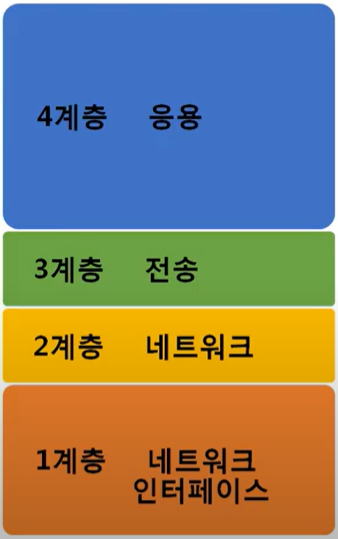
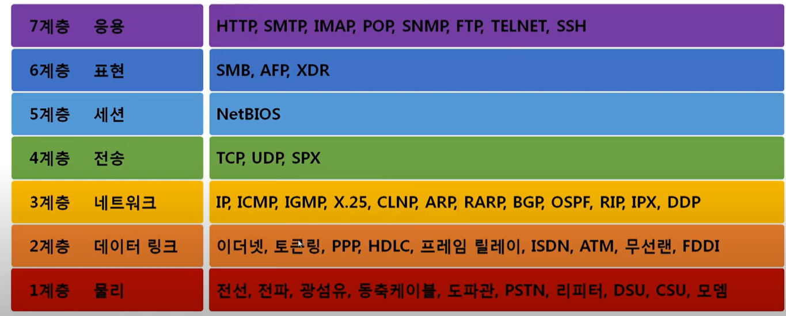

전체영상: [네트워크 기초(개정판)](https://www.youtube.com/playlist?list=PL0d8NnikouEWcF1jJueLdjRIC4HsUlULi)

### [네트워크란?](https://youtu.be/Av9UFzl_wis?list=PL0d8NnikouEWcF1jJueLdjRIC4HsUlULi)

> 분산되어 있는 컴퓨터를 연결한 통신망

- 인터넷
  - 문서, 그림, 영상 등 데이터를 공유하도록 전세계를 연결하는 네트워크
  - www : 인터넷을 통해 웹과 관련된 데이터를 공유하는 것. (인터넷 중에서도 웹서비스)
- 네트위크의 크기에 따른 분류
  - LAN (Local Area Network)
    - 하나의 작은 네트워크 단위
  - WAN (Wide Area Network)
    - 여러 개의 LAN 네트워크를 묶은 네트워크
- 네트워크 연결 형태에 따른 분류
  - Star형
    - 중앙 장비에 모든 노드가 연결된 네트워크
  - Mesh형
    - 여러 노드들이 서로 그물처럼 연결된 네트워크
- 네트워크의 통신 방식
  - 브로드캐스트
    - 네트워크에 있는 모든 대상과 통신
  - 멀티캐스트
    - 특정 다수와 1: N 통신
  - 유니캐스트
    - 1:1 통신
- 프로토콜
  - 일종의 약속 또는 규약
  - 네트워크에서 노드와 노드의 통신에서 어떤 데이터를 어떻게 보낼지 정하기 위한 규약
  - 이더넷 프로토콜
    - 가까운 노드끼리 통신할 때
    - MAC 주소 사용
  - ICMP, IPv4, ARP
    - 멀리 있는 노드끼리 통신할 때
    - IP주소 사용
  - TCP, UCP
    - 여러가지 프로그램을 통해 통신할 때
    - 포트번호 사용

### [실습1 (tracert)](https://youtu.be/paJf7JbBWqY?list=PL0d8NnikouEWcF1jJueLdjRIC4HsUlULi)

### [실습2 (Wireshark)](https://youtu.be/vBrQ3yzerMg?list=PL0d8NnikouEWcF1jJueLdjRIC4HsUlULi)

### [네트워크 모델](https://youtu.be/y9nlT52SAcg?list=PL0d8NnikouEWcF1jJueLdjRIC4HsUlULi)

### TCP/IP 모델

### OSI 7계층 모델

- 패킷
  - 
  - 네트워크 상에서 전달되는 데이터의 형식화된 블록
  - 제어 정보(헤더)와 사용자 데이터(페이로드)로 이루어져 있다.
  - Incapsulation : 페이로드에 헤더를 붙이는 것
  - decapsulation : 패킷에서 헤더를 떼는 것
  - 2계층까지 캡슐화되어있는 상태 : 프레임
  - 3계층까지 캡슐화되어있는 상태 : 패킷
  - 4계층까지 캡슐화되어있는 상태: 세그먼트

