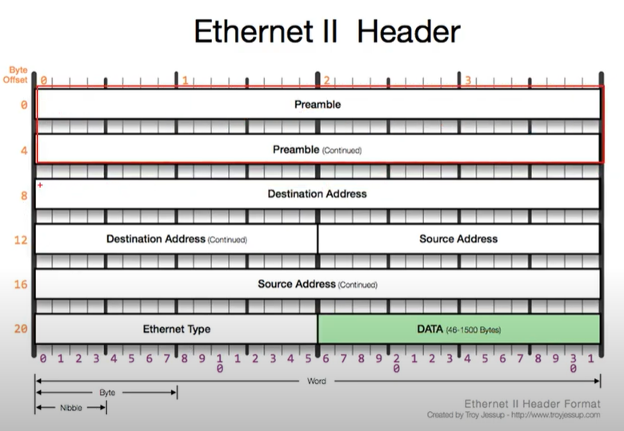

영상: [[따라學IT] 03. 가까이 있는 컴퓨터끼리는 이렇게 데이터를 주고받는다](https://youtu.be/HkiOygWMARs?list=PL0d8NnikouEWcF1jJueLdjRIC4HsUlULi)

### 2계층에서 하는일

- 하나의 네트워크 대역. 즉, 같은 네트워크 상에 존재하는 장비끼리 데이터를 전달한다.

- Local Area Network에서 데이터를 주고 받는 방식을 의미한다.
- 다른 네트워크와 통신할 때는 항상 3계층의 주소와 프로토콜을 이용하여야만 가능하다.

#### MAC주소

- LAN에서 통신할 때 사용하는 주소
- 물리적인 주소
- AA:AA:AA:AA:AA:AA 의 형태로 총 6바이트
  - 앞에 3바이트는 랜카드 제조 회사의 고유번호(?)
  - 

### 2계층(Ethernet) 프로토콜

- Preamble :
- Destination Address 
  - 목적지 MAC주소 
  - 6바이트
- Source Address
  - 출발지 MAC주소
  - 6바이트
- Ethernet Type 
  - payload안에 상위(3)계층 프로토콜이 있는데, 어떤 프로토콜(0800 : IPv4, 0806 : ARP 등)이 있는 지 미리 알려주는 역할
  - 2바이트
  - 0800 : IPv4, 0806 : ARP
- DATA : payload