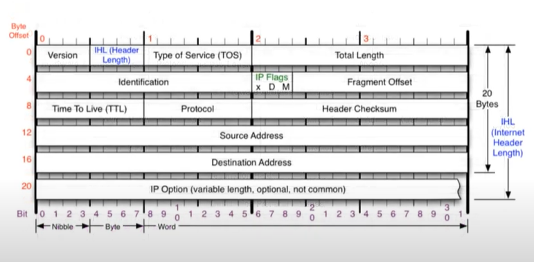

영상: [[따라學IT] 04. 실제로 컴퓨터끼리는 IP주소를 사용해 데이터를 주고받는다](https://youtu.be/s5kIGnaNFvM?list=PL0d8NnikouEWcF1jJueLdjRIC4HsUlULi)

### 3계층의 기능

- WAN에서 즉, 다른 네트워크 끼리 데이터를 주고 받는 방식
- IPv4 주소 : 현재 PC에 할당된 IP 주소
- 서브넷 마스크 : IP주소에 대한 네트워크의 대역을 규정하는 것
  - 2진수로 표기했을 때, 1과 0이 바뀌는 부분으로 네트워크 대역과 호스트를 구분한다.
  - 2진수로 표기했을 때 1은 네트워크 대역을 나타내고, 0은 호스트를 나타낸다.

- 게이트웨이 주소 : 외부와 통신할 때 사용하는 네트워크의 출입구

#### ARP 프로토콜

- ARP 프로토콜은 같은 네트워크 대역에서 통신을 하기 위해 필요한 MAC주소를 IP주소를 이용해서 알아오는 프로토콜이다.
- 같은 네트워크 대역에서 통신을 하더라도 통신과정에서 7계층부터 캡슐화를 통해 데이터를 보내기 때문에 IP주소와 MAC주소가 모두 필요하다. 이 때 IP주소만 알고 MAC주소는 모르더라도 ARP를 통해 통신이 가능하다.
- ARP 프로토콜의 목적 상 3계층임에도 같은 네트워크 대역에서만 쓰인다.

- Hardare type
  - 대부분 ethernet
  - 00.01
  - 2바이트
- Protocol type
  - IPv4
  - 08.00
  - 2바이트
- Hardware Address Length
  - MAC주소 길이
  - 6바이트
  - 06
- Protocol Address Length
  - IPv4 주소 길이
  - 4바이트
  - 04
- Opcode
  - IP주소를 통한 MAC주소 요청시 00.01
  - 요청에 대한 MAC주소 응답시 00.02

- Source Hardware Address
  - 6바이트
  - 출발지의 MAC주소
- Source Protocol Address
  - 4바이트
  - 출발지 IPv4의 주소
- Destination Hardware Address
  - 6바이트
  - 목적지의 MAC주소
- Destination Protocol Address
  - 4바이트
  - 목적지 IP주소

#### ARP 프로토콜의 통신 과정

- LAN에서 MAC주소를 알기 위해 브로드캐스트 요청을 보낸다. 

- 이 때 2계층 이더넷 헤더를 구성 할 때 목적지의 MAC주소를 모른다.
  - 왜? MAC주소를 알려고 보내는 프로토콜이기 때문에 당연히 MAC주소를 모른다.
  - 이 경우, 목적지 MAC주소를 브로드 캐스트로 보낸다. FF.FF.FF.FF.FF.FF
- 같은 네트워크 상의 모든 IP들은 패킷을 디캡슐레이션 하면서 먼저 2계층 이더넷 프로토콜의 목적지 MAC주소가 브로드캐스트임을 확인한다.
- 다음 3계층을 디캡슐레이션하면서 목적지 IP주소와 자신의 IP 주소가 일치하지 않는 노드들은 패킷을 버린다.
- IP주소가 일치하는 컴퓨터만 ARP프로토콜에 Opcode를 00.02로 하여 온 MAC주소로 보낸다.
- ARP프로토콜을 보낸 컴퓨터에서는 해당 패킷을 받고 IP에 대한 MAC 주소를 알게 된다.

#### ARP 테이블

> 통신 했던 컴퓨터들의 주소는 ARP 테이블에 남는다.

#### IPv4 프로토콜

- 네트워크 상에서 데이터를 교환하기 위한 프로토콜
- 데이터가 정확하게 전달될 것을 보장하지는 않는다.
  - 중복된 패킷을 전달하거나 패킷의 순서를 잘못 전달할 가능성이 있다.
- 데이터의 정확하고 순차적인 전달은 상위 프로토콜인 TCP에서 보장한다.

- Version
  - 4
- IHL(Header Length)
  - 헤더의 길이는 최소 20바이트 ~ 60바이트까지 커질 수 있다.
  - 4비트 할당 -> 최대 15바이트 까지 밖에 표현 못함. -> (헤더의 길이 / 4)의 값을 할당한다. 

- Type of Service(TOS)
  - 1바이트 - 지금은 사용하지 않는다
  - 0으로 채워져 있다.
- Total Length
  - 헤더 + payload까지 합친 전체 길이
- Identification
  - 원래 하나의 데이터가 여러 개의 패킷으로 쪼개진 경우 이를 보장하기 위한 id
- IP Flags
  - 3 비트
  - 첫번째 bit - 사용 x
  - D - 데이터를 조각화하지 않고 보내겠다고 명시하는 경우 1로 세팅 - 거의 사용 x
  - M - More Fragmentation : 조각화가 되어있는 경우 1로 세팅이 된다.
- Fragment Offset
  - 데이터 조각을 원래대로 복구할 때 순서를 나타낸다.
  - 3바이트 + 1비트
- Time To Live(TTL)
  - 패킷의 수명, 유통기한
  - 상대방 컴퓨터의 운영체제를 알아보는데 응용할 수 있다.
    - window : 128로 설정
    - linux : 64로 설정
- Protocol
  - 상위 계층의 프로토콜 종류를 나타낸다.
  - TCP, UDP 등
- Header Checksum
  - 헤더의 정보가 정확한지 확인하는 값.
- Source Address
  - 출발지 IP주소
- Destination Address
  - 목적지 IP주소

#### ICMP 프로토콜

> Internet Control Message Protocol
>
> 운영체제에서 오류메시지를 전송받는데 주로 쓰인다.
>
> 프로토콜의 Type과 Code를 통해 오류메시지를 전송받는다.
>
> 대표적으로 상대방과 통신이 되는지 확인하기 위해 사용

- Type
  - 대분류
  - 0 : Echo Reply - 응답
  - 8 : Echo - 요청
  - 3 : Destination Unreachable
  - 11 : Time Exceded - 상대방 문제 ex) 상대병 방화벽에 막힘
  - 5 : Redirect - 원격지의 상대방 라우팅 테이블을 수정할 때 사용
- Code
  - 소분류
- Checksum

### 일반적인 IP 주소

#### 사설IP와 공인 IP

- 사설 IP
  - 같은 네트워크 대역에서 사용하는 IP
  - 외부 네트워크에서는 사설IP는 보이지 않는다.
  - 공인IP 1개당 2^32개의 사설IP
- 공인 IP
  - 다른 네트워크 대역과 통신할 때 사용하는 IP
  - 같은 네트워크 대역의 다른 사설 IP들은 모두 같은 공인IP로 바뀌어서 통신된다.
- NAT

### 특수한 IP 주소

- 0.0.0.0
  - 나머지 모든 IP
- 127.0.0.1
  - 자기 자신을 뜻하는 IP
- 게이트웨이 주소
  - 외부 네트워크로 통신하기 위한 출구

### 라우팅 테이블

> 패킷의 최적의 이동경로를 저장해놓고 있는 테이블

### IPv4 조각화

> 보내는 데이터가 MTU(1500byte)보다 크면 IPv4 프로토콜에서 여러 패킷으로 나누는 것.

- 큰 IP 패킷들이 적은 MTU(Maximum Transmission Unit)를 갖는 링크를 통하여 전송되려면 조각화가 필요하다.
- 즉, 패킷이 통과하는 각 라우터마다 전송에 적합한 프레임으로 변환이 필요하다.
- 중간 라우터에서도 IP 조각화 가능하다.
- 재조립은 최종 수신지에서만 가능하다.

### IPv4 조각화 문제

보내려는 데이터 크기 : 2379byte

MTU : 980byte

1. 몇개의 패킷으로 쪼개지는가?

   - IP헤더가 20byte일 때,

   - 데이터는 960 + 960 + 459 로 총 3개로 나누어진다.

2. 첫번재 패킷의 데이터 크기는 몇인가?

   - 960
   - offset : 0

3. 두번째 패킷의 offset?

   1. 960 / 8 = 120바이트

4. 마지막 패킷의 데이터 크기는 몇인가?

   - 459
