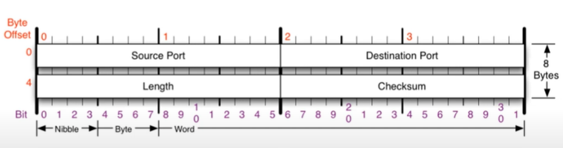
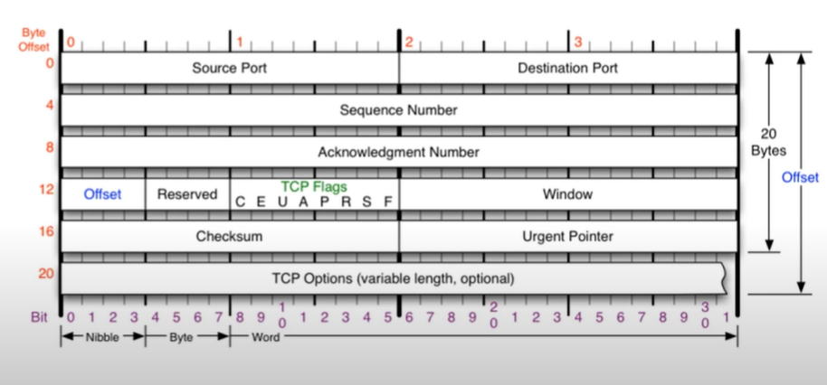
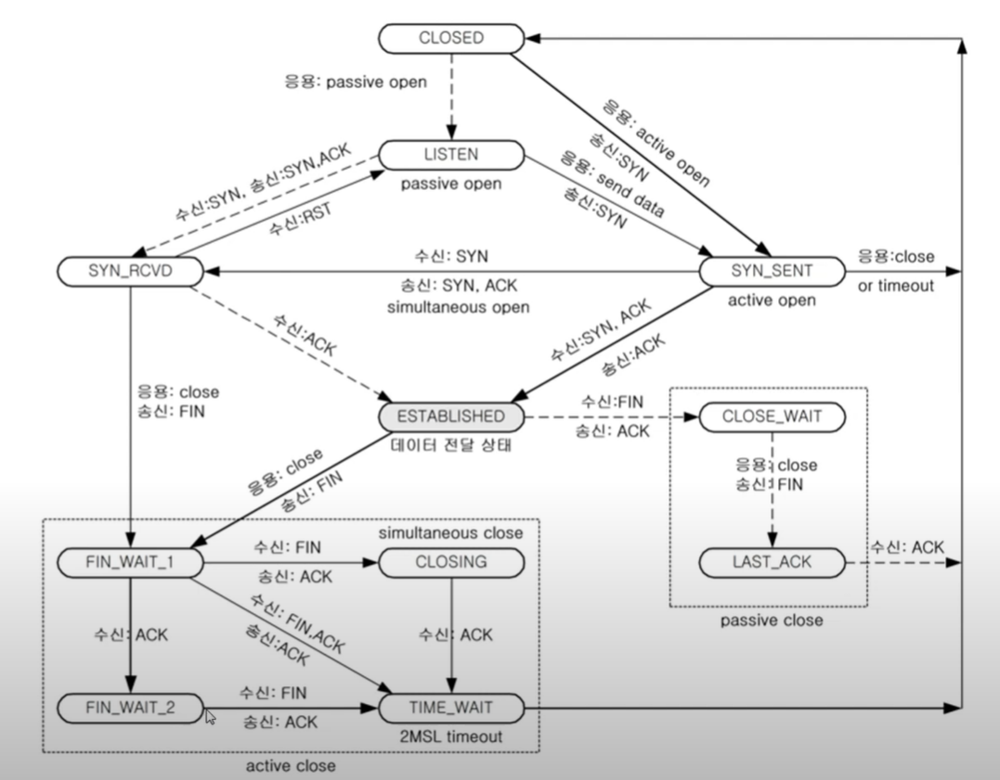

### 4계층 프로토콜

- 전송 계층(4계층)은 송신자의 프로세스와 수신자의 프로세스를 연결하는 통신 서비스를 제공한다.
- 전송 계층은 연결 지향 데이터 스트림 지원,  신뢰성, 흐름 제어, 그리고 다중화와 같은 편리한 서비스를 제공한다.
- 대표적인 전송 프로토콜 두 가지
  - TCP
    - 연결 지향 전송 방식
  - UDP
    - 사용자 데이터그램 프로토콜
    - 비연결 방식

### Port

- 프로세스 간 통신을 하기 위해 사용한다.
- 하나의 포트는 하나의 프로세스만 사용 가능하다.
- 하나의 프로세스가 여러 개의 포트를 사용하는 것은 가능하다.
- 포트 번호는 일반적으로 정해져 있지만 무조건 지켜야 하는 것은 아니다.
- Well-Known Port
  - FTH : 20, 21
  - SSH : 22
  - TELNET : 23
  - DNS: 53
  - DHCP: 67, 68
  - TFTP: 69
  - HTTP: 80
  - HTTPS: 443
- Registered Port
- Dynamic Port

### UDP

- User Datagram Protocol
- 단순한 전송 방식으로 데이터그램의 도착 순서가 바뀌거나, 중복되거나, 누락되기도 한다.
- 오류의 검사와 수정이 필요 없는 프로그램에서 사용하는 전송방식이다.

- UDP 프로토콜을 사용하는 대표적인 프로그램들
  - DNS 서버
    - 도메인에 대한 IP주소 응답
  - tfpt 서버
    - UDP로 데이터 통신
  - RIP 프로토콜
    - 라우팅 정보를 공유

### TCP

- 전송제어 프로토콜. Transmission Control Protocol
- 프로그램 간에 통신을 안정적으로, 순서대로, 에러없이 교환할 수 있게 한다.
- TCP는 UDP보다 안전하지만 느리다.

- Source Port
- Destination Port
- Sequence Number
- Acknowledgement Number
- Offset
  - 헤더의 길이 / 4
- Reserved
  - 예약된 필드. 사용하지 않는다.
- **TCP Flags**
  - TCP의 기능을 표시
  - C E U A P R S F
  - 8비트
- Window
  - 남아 있는 TCP 버퍼 공간을 표시
- Checksum
  - 헤더의 정보가 맞는지 확인
- Urgent Pointer
  - TCP Flags의 U 비트가 1일때 긴급데이터의 위치값을 표시

#### TCP Flags

- U 
  - Urgent bit
- A
  - Acknowledgement bit
  - 연결 승인 시 사용
- P
  - Push bit
  - TCP buffer의 공간에 상관없이 데이터를 전송하겠다.
- R
  - Reset bit
  - 연결 관계를 초기화 할 때
- S
  - Sync bit
  - 상대방과 연결을 시작할 때(동기화) 활성화
- F
  - Finish bit
  - 연결을 종료할 때 사용

#### TCP의 통신 과정

- 연결 수립 과정 
  - 프로세스 간의 연결을 위해 가장 먼저 수행되는 과정
  - TCP 패킷만을 캡슐화해서 통신
  - 3Way Handshake
    1. 클라이언트가 서버에게 요청 패킷을 보낸다. 
       - (Flag : SYN, Sequence Number : 100, Acknowledgement Number: 0)
       - 클라이언트 : active open -> SYN SENT 상태
       - 서버 : Listening 상태 -> SYN RECEIVED 상태
    2. 서버가 클라이언트의 요청 허락 패킷을 보낸다. 
       - (Flag : SYN + ACK, S : 2000, A : 101)
       - 클라이언트 :ESTABLISHED 상태
       - 서버 : 계속 SYN RECEIVED 상태
    3. 클라이언트는 최종 수락하는 패킷을 보낸다. 
       - (Flag : ACK, S : 101, A: 2001)
       - SEQ : 받은 패킷의 ACK 번호
       - ACK : 받은 SEQ번호 + 1
       - 둘다 ESTABLISHED 상태
  
- 데이터 수립 과정
  - TCP 헤더 + 페이로드를 포함한 패킷을 통신할 때 통신 과정
  - 보낸 쪽에서 또 보낼 때는 SEQ번호와 ACK번호가 그대로다.
  - 받는 쪽의 SEQ번호는 받은 ACK번호가 된다.
  - 받는 쪽의 ACK번호는 받은 SEQ번호 + 데이터 크기가 된다.

#### TCP 상태전이도

- LISTEN
  - 포트를 열어놓은 상태 (클라이언트 요청을 들을 준비가 된 상태)
- ESTABLISHED
  - 연결이 수립된 상태
  - 3way handshake가 끝나면 ESTABLISHED 상태가 된다.