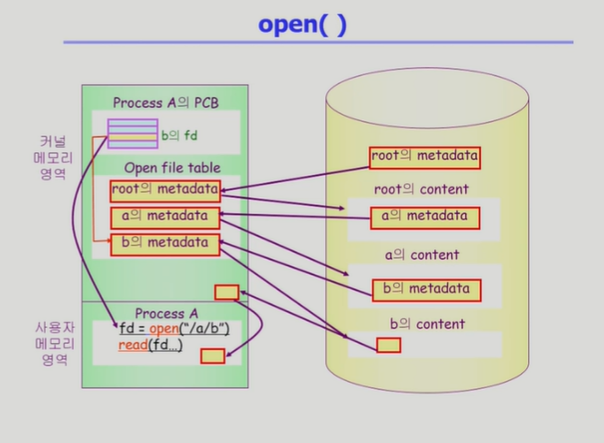
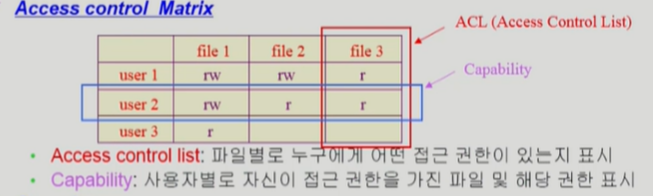
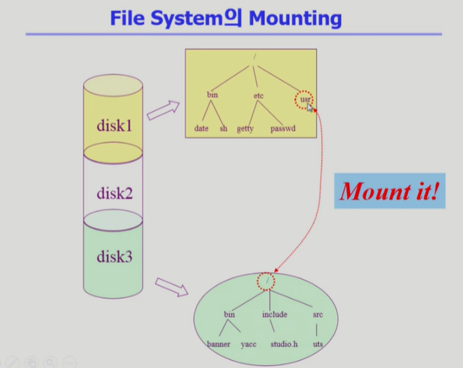
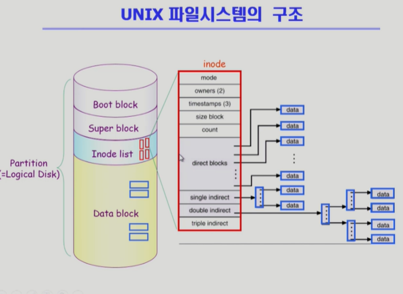
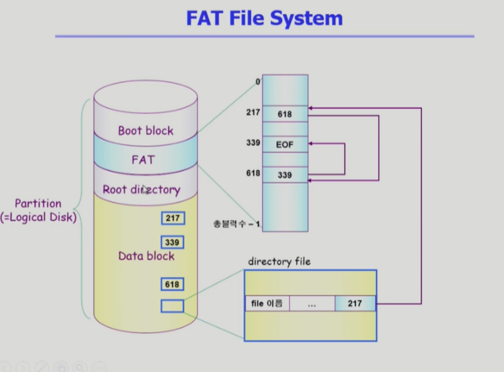
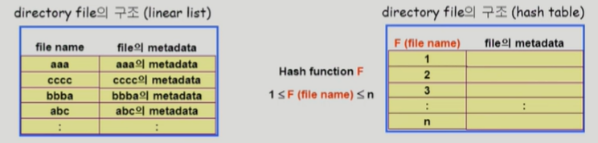
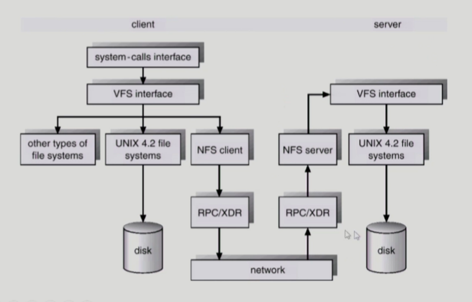
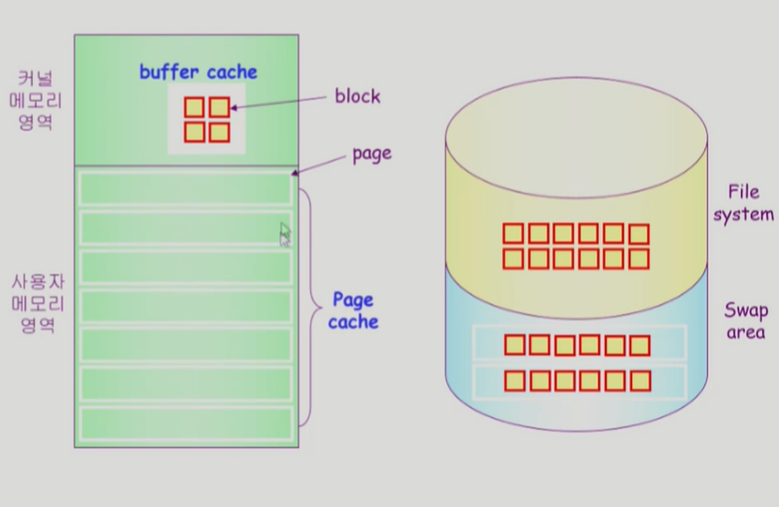
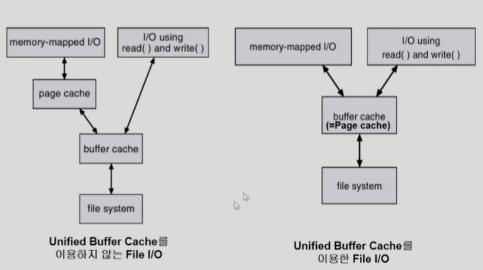
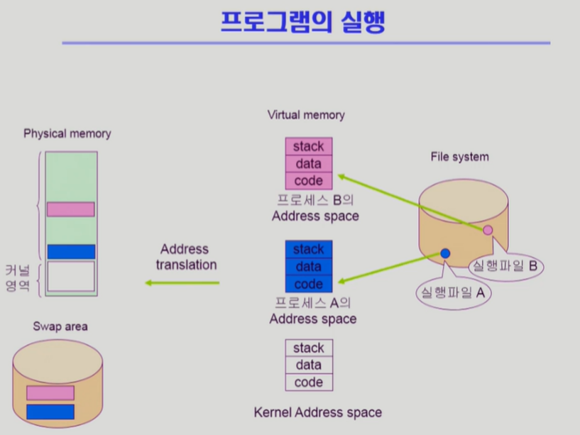

## [파일 시스템 #1](https://core.ewha.ac.kr/publicview/C0101020140516150939191200?vmode=f)

### File and File System

- File
  - "A named collection of related information"
  - 일반적으로 비휘발성의 보조기억장치에 저장
  - 운영체제는 다양한 저장장치를 file이라는 동일한 논리적 단위로 볼 수 있게 해준다.
  - Operation
    - create, read, write, reposition, delete, open, close

- File attribute(metatdata)
  - 파일 자체의 내용이 아니라 파일을 관리하기 위한 각종 정보들
    - 파일 이름, 유형, 저장 위치, 파일 사이즈
    - 접근 권한, 시간, 소유자

- File system
  - 운영체제에서 파일을 관리하는 부분
  - 파일 및 파일의 메타데이터, 디렉토리 정보 등을 관리
  - 파일의 저장 방법 결정
  - 파일 보호

### Directory and Logical Disk

- Directory
  - 일종의 파일
  - 파일의 메타데이터 중 일부를 보관하고 있는 일종의 특별한 파일
  - 그 디렉토리에 속한 파일 이름 및 파일 attribute
  - operation
    - search for a file, create a file, delete a file
    - list a directory, rename a file, traverse the file system

- Partition (=Logical Disk)
  - 하나의 (물리적)디스크 안에 여러 파티션을 두는 것이 일반적이다.
  - 여러 개의 물리적인 디스크를 하나의 파티션으로 구성하기도 함.
  - (물리적)디스크를 파티션으로 구성한 뒤 각각의 파티션에 file system을 깔거나 swapping 등 다른 용도로 사용할 수 있음

### open( )

- open("/a/b/c")
  - 디스크로부터 파일 c의 메타데이터를 메모리로 가지고 온다는 의미
  - 이를 위해 directory path를 search
    1. 루트 디렉토리 "/"를 open하고 그 안의 파일 "a" 위치 획득
    2. "a"를 open하고 "b" 획득
    3. "b" open하고 "c" 획득
    4. "c" open
  - directory path 검색에 너무 많은 시간이 소요
    - open을 read/write를 별도로 두는 이유다.
    - 한번 open한 file은 directory search 불필요
  - open file table
    - open file들의 메타데이터 보관소
    - 디스크 메타데이터보다 몇가지 정보 추가
      - open한 프로세스의 수
      - File offset: 파일 어느 위치 접근 중인지 표시(별도 데이터 불필요)
    - File descriptor
      - open file table에 대한 위치 정보

### File Protection

- 각 파일에 대해 누구에게 어떤 유형의 접근(read/write/execution)을 허락할 것인가?

- Access Control 방법

  - Access Control Matrix

    

    - Access control list : 파일별로 연결리스트로 구현 가능
    - Capability : 사용자별 연결리스트로 구현 가능
    - 행렬의 메모리 낭비를 줄일 수 있다.

  - Grouping

    - 전체 user를 owner, group, public 세 그룹으로 구분
    - 각 파일에 대해 세 그룹의 접근 권한을 3비트씩 표시
    - UNIX에서 사용.

  - Password

    - 파일마다 Password를 두는 방법 (디렉토리에 파일을 두는 방법도 가능하다)
    - 모든 접근 권한에 대해 하나의 password: all-or-nothing
    -  접근 권한별 password: 암기 문제, 관리 문제

### File System의 Mounting

- mount : 서로 다른 파티션에 존재하는 파일시스템에 접근할 수 있게 함.

### Access Methods

- 시스템이 제공하는 파일정보의 접근 방식
  - 순차 접근
    - 카세트 테이프를 사용하는 방식처럼 접근
    - 읽거나 쓰면 offset은 자동적 증가

  - 직접 접근
    - LP 레코드 판과 같이 접근
    - 파일을 구성하는 레코드를 임의의 순서로 접근 가능.

## [파일 시스템 구현 #1](https://core.ewha.ac.kr/publicview/C0101020140520134614002164?vmode=f)

### Allocation of File Data in Disk (이론)

> 디스크에 파일 데이터를 저장하는 세 가지 방법

- Contiguous Allocation
  - 하나의 파일이 디스크 상에 연속해서 저장되는 방법
  - 단점
    - external fragmentation
      - 블럭들의 크기가 각기 다르기 때문에 비어 있는 공간임에도 활용되지 못하는 현상 발생

    - 할당된 공간 뒤에 빈공간이 없는 경우 파일의 크기를 키우는 데 제약이 있다.

  - 장점
    - Fast I/O
      - 한 번의 seek/rotation으로 많은 바이트 전송 가능

    - Direct access(=random access) 가능

- Linked Allocation
  - 파일의 데이터를 연속적으로 저장하지 않고 임의의 블럭에 저장한다.
  - 파일의 디렉토리에는 시작 블록과 끝 블록에 대한 위치 정보만 있고, 디스크의 각 블럭에 다음 블록의 포인터가 저장되어 있다.
  - 장점
    - External framgentation 발생 안함

  - 단점
    - Direct access가 불가능하다.
    - Reliability 문제
      - 한 sector가 고장나 포인터가 유실되면 그 뒤의 부분을 모두 잃는다.

    - 포인터를 위한 공간이 블럭 일부가 되어 공간 효율성이 떨어진다.
      - 512 bytes/sector

  - 변형된 방법
    - File-allocation table(FAT) 파일 시스템
    - 포인터를 별도의 위치에 보관하여 reliability와 공간효율성 문제를 보완한 방법

- Indexed Allocation
  - 직접 접근이 가능하게 하기 위해서 디렉토리에 index block의 위치를 저장해놓고, index block에 파일 데이터가 저장된 블록위치를 순서대로 저장해놓은 방식
  - 장점
    - External fragmentation 발생 안하면서 직접 접근이 가능하다.
  - 단점
    - 파일이 매우 작은 경우 index block으로 인해 공간이 낭비된다.
    - 파일이 매우 큰 경우 index block에 모든 정보를 저장하기 부족하다.
      - 해결방안 1 : linked scheme
      - 해결방안 2 : multi-level index

### UNIX 파일시스템의 구조

- 유닉스 파일 시스템의 중요 개념
  - Boot block
    - 부팅에 필요한 정보(bootstrap loader)
  - Superblock
    - 파일 시스템에 관한 총체적인 정보를 담고 있다.
  - Inode
    - 파일 이름을 제외한 파일의 모든 메타 데이터를 저장
  - Data block
    - 파일의 실제 내용을 보관
    - 디렉토리 파일에 file 이름과 inode 번호를 저장하고 있다.

### FAT File System

- 유닉스 파일시스템과 달리 Data block의 directory file에 다음 블럭의 위치 정보를 제외한 파일의 모든 메타 데이터를 저장하고 있다. 다음 블럭의 위치 정보는 FAT에 따로 보관한다. FAT은 이미 메모리에 올라가 있기 때문에(?) 직접 접근이 가능하다.

### Free-Space Management

> contiguous allocation으로 인한 빈 공간을 운영하는 방법

- Bit map or bit vector
  - bit[i] = 0 : free / bit[i] = 1 : occupied
  - Bit map은 부가적인 공간을 필요로 함
  - 연속적인 n개의 free block을 찾는데 효과적
- linked list
  - 비어있는 블럭들을 linked list로 관리하는 방법
  - 연속적인 가용공간을 찾는 것은 쉽지 않다는 단점.
  - 공간 낭비가 없다는 장점이 있다.
- Grouping
  - linked list 방법의 변형
  - 첫 번째 free block이 n개의 포인터를 가짐
  - n - 1개의 포인터는 빈 블록을 가리킴.
  - 마지막 포인터가 가리키는 블록은 또 다시 n개의 포인터를 가짐
- Counting
  - 프로그램들이 종종 여러 개의 연속적인 block을 할당하고 반납한다는 성질에 착안
  - (첫번째 빈 블록, 연속적인 빈블록의 개수) 쌍으로 관리한다.

### Directory Implementation

- Linear list
  - <file name, file의 metadata>의 list
  - 구현이 간단
  - 디렉토리 내에 파일이 있는지 찾기 위해서는 선형 탐색이 필요

- Hash Table
  - linear list + hashing
  - Hash table은 file name을 이 파일의 linear list의 위치로 바꾸어줌.
  - search time을 없앰
  - Collision 발생 가능

- File의 metadata 보관 위치
  1. 디렉토리 내 직접 보관
  2. 디렉토리에 포인터를 두고 다른 곳에 보관
     - inode, FAT 등
- Long file name의 지원
  - file name이 고정 크기의 entry 길이보다 길어지는 경우 entry의 마지막 부분에 이름의 뒷부분이 위치한 곳의 포인터를 두는 방법

### VFS and NFS

- Virtual File System(VFS)
  - 다양한 file system에 대해 동일한 시스템 콜 인터페이스를(API) 통해 접근할 수 있는 OS layer

- Network File System(NFS)
  - 분산 시스템에서는 네트워크를 통해 파일이 공유될 수 있다.
  - NFS는 분산 환경에서의 대표적 파일 공유 방법이다.

## [파일 시스템 구현 #2](https://core.ewha.ac.kr/publicview/C0101020140523142954456205?vmode=f)

### Page Cache and Buffer Cache

- 페이지 캐시
  - 가상 메모리의 paging system과 같은 뜻으로,  page frame을 캐싱의 관점에서 설명하는 용어이다.
  - Memory-Mapped I/O를 쓰는 경우 file의 I/O에서도 페이지 캐시를 사용한다.
- **Memory-Mapped I/O**
  - File의 일부를 가상 메모리에 매핑 시키는 것!
  - 매핑시킨 영역에 대한 메모리 접근 연산은 파일의 입출력을 수행하게 함
  - 사용자 메모리 영역에 올라와 있는 경우 파일을 읽고 쓸 수 있기 때문에 기존의 버퍼캐시에 접근하는 운영체제 호출을 줄일 수 있다는 장점이 있다.
  - 단점. 메모리 캐시에 매핑을 해놓는 것이기 때문에 다른 프로세스와의 consistency가 깨질 수 있는 위험이 있다.
- 버퍼 캐시
  - 파일 시스템을 통한 I/O 연산은 메모리의 특정 영역인 버퍼 캐시를 사용
  - 파일 사용의 locality 활용
    - 한 번 읽어온 block에 대한 후속 요청 시 버퍼 캐시에서 즉시 전달

  - 모든 프로세스가 공용으로 사용
  - LRU, LFU 등 교체 알고리즘이 필요하다
- Unified 버퍼 캐시
  - 최근의 OS에서는 기존의 버퍼 캐시가 페이지 캐시에 통합됨
  - 
  - 버퍼 캐시와 페이지 캐시가 공유되는 개념이기 때문에 기존의 버퍼캐시에서 페이지캐시로 옮기는 단계를 생략 가능하다.

### 프로그램의 실행

- 프로그램은 파일 시스템에 실행 파일 형태로 저장 -> 실행시키면 프로세스가 되고 프로세스의 가상 주소 공간이 만들어 짐
- 프로세스의 세 가지 구성 stack, data, code 중 code는 file system에 저장되어 있다.
  - 따라서 code는 메모리에 올라왔다가 swap area로 쫓겨 나지 않는다.
- 실행파일에 해당하는 code부분은 별도의 swap area를 가지고 있지 않고 파일시스템에 저장되어 있어서 그대로 가상 주소 공간에 매핑이 되어 있다.