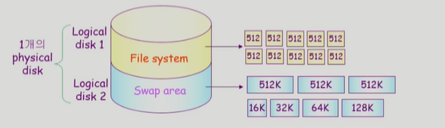

## [디스크 관리 및 스케쥴링 #1](https://core.ewha.ac.kr/publicview/C0101020140523151255773807?vmode=f)

### Disk Structure

- logical block
  - 디스크의 외부에서 보는 디스크의 단위 정보 저장 공간들
  - 주소를 가진 1차원 배열처럼 취급
  - 정보를 전송하는 최소 단위

- sector
  - logical block이 물리적인 디스크에 매핑된 위치
  - Sector 0은 최외곽 실린더의 첫 트랙에 있는 첫 번째 섹터이다.

### Disk Management

- pyhsical formatting (low-level formatting)
  - 디스크를 컨트롤러가 읽고 쓸수 있도록 섹터들로 나누는 과정
  - 각 섹터는 헤더 + 실제 data(512bytes) + trailer로 구성된다.
  - 헤더와 트레일러는 sector number, ECC (Error-Correcting Code) 등의 정보가 저장되며 controller가 직접 접근 및 운영

- Partitioning
  - 디스크를 하나 이상의 실린더 그룹으로 나누는 과정
  - OS는 이것을 독립적 disk로 취급(logical disk)

- Logical formatting
  - 파일 시스템을 만드는 것
  - FAT, inode, free space 등의 구조 포함

- Booting
  - ROM에 있는 "small bootstrap loader"의 실행
  - sector 0 (boot block)을 load하여 실행
  - sector 0은 "full Bootstrap loader program"
  - OS를 디스크에서 load하여 실행

### Disk Scheduling

- Access time의구성
  - Seek time
    - 헤드를 실린더로 움직이는 데 걸리는 시간

  - Rotationary latency
    - 헤드가 원하는 섹터에 도달하기까지 걸리는 회전지연시간

  - Transfer time
    - 실제 데이터의 전송 시간

- Disk bandwidth
  - 단위 시간 당 전송된 바이트 수

- Disk Scheduling
  - seek time을 최소화 하는 것이 목표

### Disk Scheduling Algorithm

- FCFS(First Come First Service)
  - 들어온 순서대로 처리해주기

- SSTF(Shortest Seek Time First)
  - 현재 헤드위치에서 제일 가까운 요청을 먼저 처리하기
  - starvation 문제 발생

- SCAN
  - 디스크 암이 디스크 한쪽 끝에서 반대 끝으로 이동하며 가는 길목에 있는 모든 요청을 처리한다.
  - 비교적 효율적이면서 starvation 문제도 해소할 수 있다.
  - 실린더 위치에 따라 대기 시간이 다르다. 가운데 지점은 최악의 경우 반바퀴, 양 끝은 최악의 경우 한바퀴 대기해야 함.

- C-SCAN
  - 헤드가 끝에서 끝으로 이동하며 모든 요청을 처리하고(SCAN과 동일), 다시 출발점으로 이동해서 반복
  - 헤드의 이동은 더 많아질 수 있어도, SCAN보다 균일한 대기 시간을 제공한다. 

- Other Algorithms
  - N-SCAN
    - 일단 arm이 한 방향으로 움직이기 시작하면 그 시점 이후 도착한 job은 되돌아올 때 service

  - LOOK and C-LOOK
    -  헤드가 진행 중이다가 이동방향에 더 이상 요청이 없으면 방향을 바꾸는 방법

### Disk-Scheduling Algorithm의 결정

- SCAN, C-SCAN 및 그 응용 알고리즘은 LOOK, C-LOOK 등이 일반적으로 디스크 입출력이 많은 시스템에서 효율적인 것으로 알려져 있다.
- File의 할당 방법에 따라 디스크 요청이 영향을 받음
- 디스크 스케줄링 알고리즘은 다른 알고리즘으로 쉽게 교체 가능하도록 OS와 별도의 모듈로 작성되는 것이 바람직하다.

## [디스크 관리 및 스케쥴링 #2](https://core.ewha.ac.kr/publicview/C0101020140527124647396004?vmode=f)

### Swap-Space Management

> - 물리적인 디스크를 파티셔닝해서 로지컬 디스크를 만들 수 있고, 운영체제는 이를 독립적으로 간주한다.
> - 각각의 논리적 디스크르 File System으로 사용할 수도, Swap area로 사용할 수도 있다.

- Disk를 사용하는 두 가지 이유
  - memory의 viloate한 특성 -> file system
    - 기본적으로 512byte의 섹터 단위로 데이터를 저장하고 있다.
    - File system에 데이터를 할당하는 방식은 연속할당, linked allocation, indexed allocation 등의 방법
    - FAT이나 UNIX의 파일시스템은 좀 더 효율성을 높여서 사용하고 있다.
  - 프로그램 실행을 위한 memory 공간 부족 -> swap space (swap area)
    - 물리적 메모리의 연장공간으로써 쓰는 것이기 때문에 속도가 중요하다. -> 디스크의 Seek Time을 줄이는 것이 최우선이기 때문에 공간 효율성보다는 시간효율성을 최우선시 한다.

- Swap-space
  - Virtual memory system에서는 디스크를 memory의 연장 공간으로 사용
  - 파일시스템 내부에 둘 수도 있으나 별도 partition 사용이 일반적
    - 공간효율성보다는 속도효율성이 우선
    - 일반 파일보다 훨씬 짧은 시간만 존재하고 자주 참조된다.
    - 따라서, block의 크기 및 저장 방식이 일반 파일시스템과 다름

### RAID

> Redundant Array of Independent Disks
>
> 여러 개의 디스크를 묶어서 사용하는 것.

- RAID의 사용 목적
  - 디스크의 처리 속도 향상
    - 여러 디스크에 block의 내용을 분산 저장
    - 병렬적으로 읽어 옴(interleaving, striping)
  - 신뢰성 향상
    - 동일 정보를 여러 디스크에 중복 저장
    - 단순 중복 저장이 아니라 일부 디스크에 parity를 저장하여 공간 효율성을 높일 수 있다.