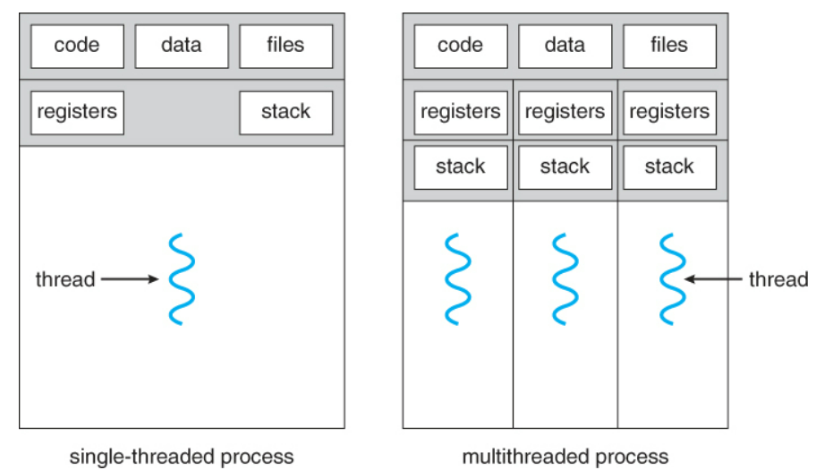

## [프로세스 #1](https://core.ewha.ac.kr/publicview/C0101020140318134023355997?vmode=f)

### 프로세스의 개념

- 실행중인 프로그램으로, 스케줄링의 대상이 되는 작업

#### 프로세스의 Context

> 프로세스가 현재 어떤 상태에 있는 지 나타내는 모든 요소

- CPU 수행 상태를 나타내는 하드웨어 문맥
  - Program Counter - 코드의 어디까지 실행된 상태인가
  - register
- 프로세스의 주소 공간
  - code, data, stack
- 프로세스 관련 커널 자료 구조
  - PCB
    - 프로세스가 실행될 때마다 운영체제가 PCB를 하나씩 두면서 해당 프로세스를 관리한다.
  - Kernel stack

### 프로세스의  상태 (Process State)

> 크게 다섯 가지의 상태로 구분된다.

- Runnig
  - CPU를 점유하여 instruction을 수행중인 상태
- Ready
  - CPU를 기다리는 상태 (메모리 등 다른 조건을 모두 만족하고)
- Blocked(wait, sleep)
  - CPU를 점유해도 당장 instruction을 수행할 수 없는 상태
  - 프로세스 자신이 요청한 **event**(ex I/O)가 즉시 만족되지 않아 이를 기다리는 상태  
- New
  - 프로세스가 생성중인 상태
- Terminated
  - 수행이 끝난 상태
- Suspended(Stopped)
  - **외부적인 이유**(ex - by 중기스케줄러) 로 프로세스의 수행이 정지된 상태
  - 프로세스는 통째로 디스크에 swap out 된다.
  - ex) 사용자가 프로그램을 일시 정지시킨 경우, 너무 많은 프로세스가 올라와 있을 때 시스템이 프로세스를 중단시킨 경우

### Process Control Block(PCB)

> 운영체제가 **각 프로세스를 관리하기 위해** 프로세스당 유지하는 정보

- 구성요소 (구조체로 가지고 있다.)
  - OS가 관리상 사용하는 정보
    - 프로세스 상태, 프로세스 ID
    - 스케줄링 정보, 우선순위
  - CPU 수행 관련 하드웨어 값
    - Program Counter, registers
  - 메모리 관련
    - Code, data, stack
  - 파일 관련
    - Open file descriptors

### 문맥 교환 (Context Switch)

> CPU가 한 프로세스에서 다른 프로세스로 넘겨주는 과정

- 문맥 교환 과정
  - CPU를 내어주는 프로세스의 상태를 그 프로세스의 PCB(커널의 메모리에?)에 저장
  - CPU를 새롭게 얻는 프로세스의 상태를 PCB에서 읽어옴
- **시스템 콜이나 인터럽트 발생 시 반드시 context switching이 일어나는 것은 아니다.**
  - 사용자 프로세스에서 다른 사용자 프로세스로 CPU의 점유가 이동하면 문맥교환이 일어나지만 하나의  프로세스와 운영체제 사이에서 CPU 점유가 이동할 때는 문맥교환이 일어나지 않는다.

### 프로세스를 스케줄링하기 위한 큐

- Job queue
  - 현재 시스템 내에 있는(모든) 프로세스에 대한 큐

- Ready queue
  - Ready 상태에 있는 프로세스에 대한 큐

- Device queues
  - I/O devices의 처리를 기다리는 프로세스에 대한 큐

### 스케줄러 (Scheduler)

- 장기 스케줄러 (JOB 스케줄러)
  - 시작 프로세스 중 어떤 것들을 ready queue로 보낼지 결정
  - 프로세스에 memory를 주는 문제 (프로세스의 new 상태에서  ready 상태로 보내는 문제)
  - **degree of multiprogramming**을 제어
  - time sharing system에는 보통 장기 스케줄러가 없다!

- 단기 스케줄러(CPU 스케줄러)
  - 어떤 프로세스를 다음번에 runnig시킬 지 결정
  - 프로세스에 CPU를 주는 문제(프로세스의 ready상태에서 runnig 상태로 보내는 문제)
  - 충분히 빨라야 함(ms 단위)

- 중기 스케줄러(Swapper)
  - 여유 공간 마련을 위해 프로세스를 통째로 메모리에서 디스크로 쫓아냄
  - 프로세스에게서 memory를 뺏는 문제
  - **degree of multiprogramming**을 제어

## [프로세스 #2](https://core.ewha.ac.kr/publicview/C0101020140321141759959993?vmode=f)

### 질문 답변 > [1, 2장 운영체제 개요 및 컴퓨터시스템의 구조](운영체제/1,-2장-운영체제-개요-및-컴퓨터시스템의-구조.md)

### Thread

>프로세스 하나에서 CPU 수행 단위만 여러 개 두고 있는 기본 단위
>
>프로세스 하나에서 CPU 수행과 관련된 정보(Program Counter, registers, stack)를 별도로 가지고 있고, 그 외의 프로세스의 주소 공간(code, data, OS resources)은 공유하고 있다.

- 다중 스레드로 구성된 태스크 구조에서는 하나의 서버 스레드가 blocked(waiting) 상태인 동안에도 동일한 태스크 내의 다른 스레드가 실행되어 빠른 처리를 할 수 있다.
  - 웹브라우저에서 네트워크를 통해서 웹페이지를 읽어오는 작업(I/O 작업)을 하는 동안에는 웹브라우저는 blocked(waiting) 상태가 된다. 만약 웹브라우저를 멀티스레드로 동작할 경우 하나의 쓰레드가 blocked 되어 있어도 다른 쓰레드가 다른 작업을 해서 사용자에게 페이지를 공백없이 보여줄 수 있다.  

## 프로세스 #3

### Single and Multithreaded Processes

- 

### Benefits of Threads

- 빠른 응답성.
  - 하나의 쓰레드가 blocked된 상태이더라도 다른 스레드가 동작할 수 있다.
  - ex) 하나의 스레드가 네트워킹(I/O 작업, blocked)중인 동안 다른 스레드가 display한다.
  - 일종의 비동기식 입출력 작업이라고 볼 수 있다.

- 자원 공유
  - CPU 수행 관련 정보(Program Counter, register)만 가지고 있고 프로세스의 task(code, data, os리소스)는 스레드끼리 공유하기 때문에 프로세스를 여러개 두는 것 보다 메모리 사용을 줄일 수 있다.

- 경제성
  - 프로세스간 context switching이 쓰레드간 CPU switching에 비해 훨씬 무거운 작업이다. overhead를 훨신 많이 잡아먹는다

- 멀티 프로세서 아키텍처에서의 유용함
  - 다른 프로세서상에서 각각의 스레드가 병렬적으로 동작할 수 있어서 효율적이다.

### Implementation of Threads

- 커널스레드
  - 커널에 의해 지원됨
  - 하나의 스레드에서 다른 스레드로 CPU가 넘어가는 것도 커널이 관리한다.
- 유저스레드
  - 라이브러리르 통해 지원됨.
  - 사용자 프로그램이 스스로 스레드를 관리한다.
