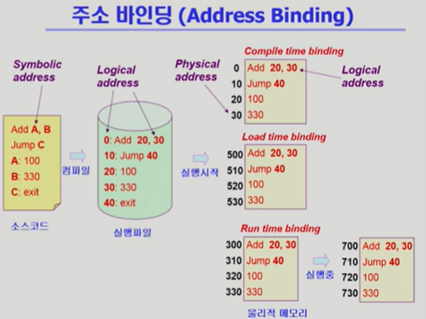
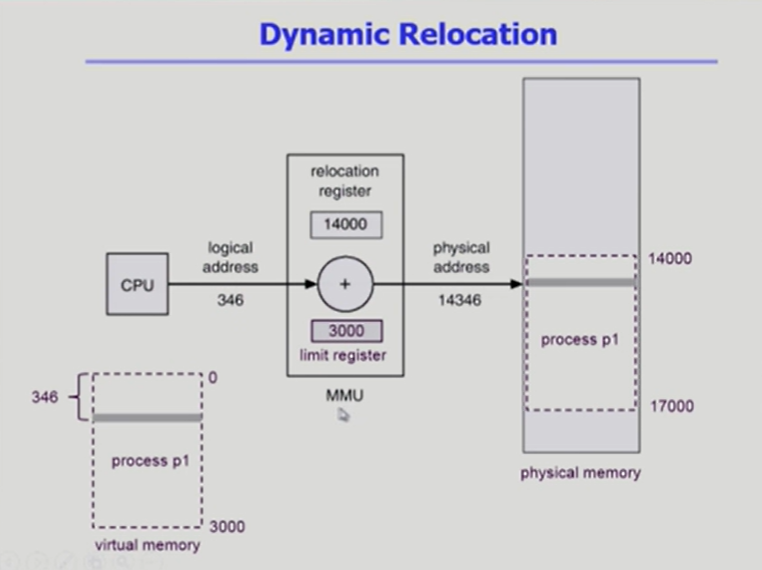

## [메모리 관리 #1](https://core.ewha.ac.kr/publicview/C0101020140425151219100144?vmode=f)

### Logical vs. Physical Address

- logical(=virtual address)
  - 프로세스마다 독립적으로 가지는 주소 공간
  - 각 프로세스마다 0번지부터 시작
  - CPU가 보는 주소는 logical address임.

- physical
  - 메모리에 실제 올라가는 위치

### 주소바인딩(Address Binding)

- 주소를 결정하는 것
- Symbolic Address -> Logical Adress -> Physical address

#### 가상메모리에서 실제메모리 주소변환이 이루어지는 시점?

- compile time binding

  - 물리적인 메모리주소가 컴파일 시 알려진다.

  - 시작 위치 변경시 재컴파일

  - 컴파일러는 절대 코드 생성
  - 너무 일찍 정해지기 때문에 비효율적이다.

- load time binding

  - 실행 시작 시 PA 결정

- Execution time binding(Run time binding)
  - 프로그램 실행 도중 물리 메모리주소 변경가능
  - MMU라는 하드웨어 지원 필요

### Memory-Management Unit(MMU)

- logical address를 physical address로 매핑해주는 하드웨어 장치

### Dynamic Relocation

### Hadware Support for Address Translation

- relocation register : 접근할 수 있는 물리적 메모리의 최소값
- limit register : 논리적 주소의 범위

### Some Treminologies

- Dynamic Loading
  - 프로세스 전체를 메모리에 미리 다 올리는 것이 아니라 해당 루틴이 불려질 때 메모리에 load하는 것
  - memory utilization 향상
  - 가끔씩 사용되는 많은 양의 코드의 경우에 유용하다.
  - 운영체제 지원 없이 프로그램 자체에서 구현이 가능하다. (OS는ㄴ 라이브러리를 제공함)
  - Loading : 메모리로 올리는 것.
- Dynamic Linking
  - Linking을 실행 시간까지 미루는 기법
  - Static linking
    - 라이브러리가 프로그램의 실행 파일 코드에 포함됨
    - 실행 파일의 크기가 커지고 동일한 라이브러리가 각각의 프로세스에 중복되므로 메모리 낭비

  - Dynamic linking
    - 라이브러리가 실행시 연결됨
    - 라이브러리 호출 부분에 라이브러리 루틴의 위치를 찾기위한 `stub`라는 작은 코드를 둔다.
    - 라이브러리가 이미 메모리에 있다면 해당 루틴의 주소로 가고 없으면 디스크에서 읽어온다.
    - 운영체제의 도움이 필요.
- Overlays
  - 메모리에 프로세스의 부분 중 실제 필요한 정보만을 올리는 것.
  - 프로세스의 크기가 메모리보다 클 때 유용하다.
  - 운영체제 지원 없이 사용자에 의해 구현
- Swapping
  - 프로세스를 일시적으로 메모리에서 backing store로 쫓아내는 것.
  - Backing store : 디스크
  - Swap in / Swap out
    - 일반적으로 중기스케줄러(swapper)에 의해 swap out 시킬 프로세스 선정
  - Run time binding에서 Swap in 시 빈 메모리 영역 아무곳에나 올리는 것이 가능하므로 효율적이다.
  - swap time의 대부분은 tranfer time 이다.

## [메모리 관리 #2](https://core.ewha.ac.kr/publicview/C0101020140429132440045277?vmode=f)

### Paging

> 프로세스의 가상메모리를 동일한 사이즈의 page단위로 나누어 noncontiguous하게 저장하는 방법

## [메모리 관리 #3](https://core.ewha.ac.kr/publicview/C0101020140502151452123728?vmode=f)

[Paging](8장-메모리-관리/Paging.md) 

## [메모리 관리 #4](https://core.ewha.ac.kr/publicview/C0101020140509142939477563?vmode=f)

[Segmentation](8장-메모리-관리/Segmentation.md) 

페이지가 프로세스의 메모리를 물리적으로 같은 크기의 페이지 단위로 쪼갠 것이라면,

세그멘테이션은 프로세스를 구성하는 주소공간을 의미 단위로 쪼갠 것이다. ex) code, data, stack

### Allocation of Physical Memory

메모리는 일반적으로 두 영역으로 나누어 할당된다.

1. OS 상주 영역
   - 낮은 주소 영역 사용
2. 사용자 프로세스 영역
   - 높은 주소 영역 사용

- Contiguous allocation
  - 각각의 프로세스가 메모리의 연속적인 공간에 적재되도록 하는 할당 방법
  - 고정 분할 방식
  - 가변 분할 방식
  - Hole
    - 가용 메모리 공간
    - 다양한 크기의 hole이 메모리 여러 곳에 흩어져 있다.
    - 프로세스가 도착하면 수용가능한 hole을 할당한다.
  - Dynamic Storage-Allocation Problem
    - 가변 분할 방식에서 메모리 size n인 요청을 만족하는 가장 적절한 hole을 찾는 문제
    - First-fit
      - size n이상인 것 중 최초로 찾아지는 hole에 할당
    - Best-fit
      - size n이상인 가장 작은 hole을 찾아 할당
    - worst-fit
      - 가장 큰 사이즈의 hole에 할당
    - compaction
      - external fragmentation 문제를 해결하는 방법 중 하나이다.
      - 사용 중인 메모리 영역을 한 군데로 몰고 hole들을 한 곳으로 몰아 큰 block을 만드는 것.
      - 매우 비용이 많이 드는 방법이다.
- **NonContiguous allocation**
  - 하나의 프로세스가 메모리의 여러 영역에 분사되어 올라갈 수 있도록 하는 할당 방법
  - [Paging](8장-메모리-관리/Paging.md)
    - 프로세스의 가상메모리를 동일한 사이즈의 page단위로, 물리메모리는 Frame단위로 나누어 noncontiguous하게 저장하는 방법
    - 일부는 backing storage, 일부는 물리메모리에 저장한다.
  - [Segmentation](8장-메모리-관리/Segmentation.md)
    - code, data, stack segmentation
  - Paged Segmentation

**주소변환 과정은 모두 하드웨어에 의해 이루어지고, 운영체제의 개입은 없다. 그 이유는 주소변환을 할 때마다 운영체제가 개입하게 되면 메모리를 불러올 때마다 CPU가 사용자 프로세스와 운영체제 사이를 넘나들어야 하기 때문이다.**

