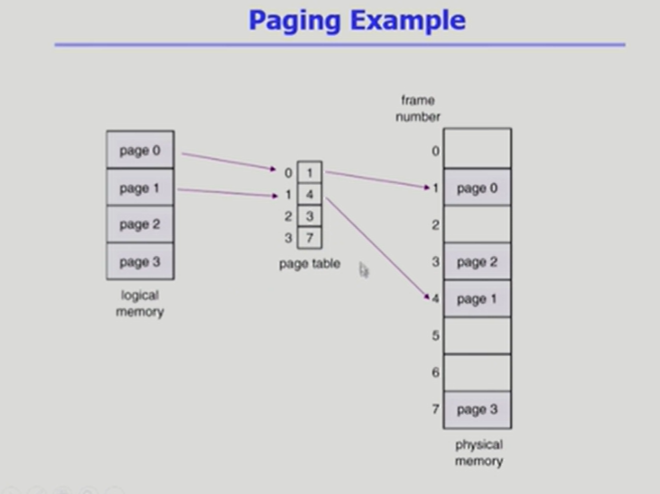
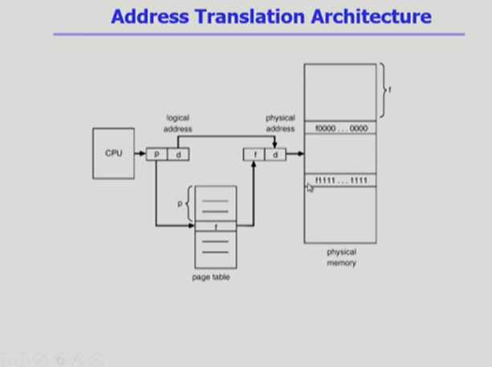
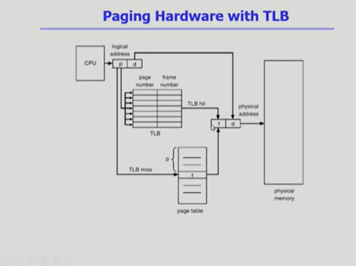
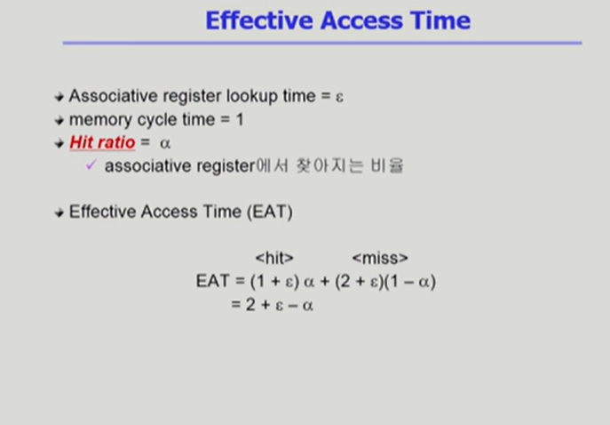
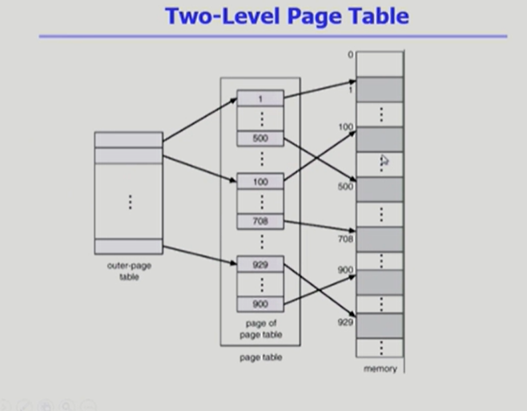
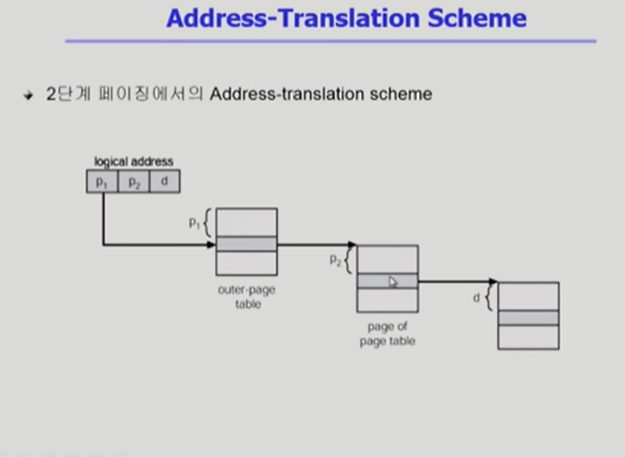
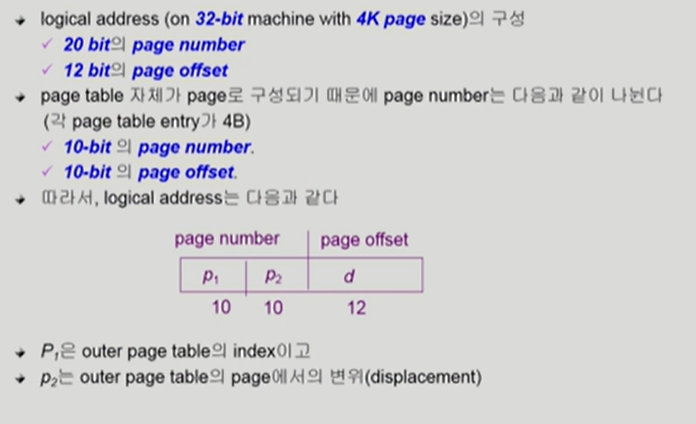
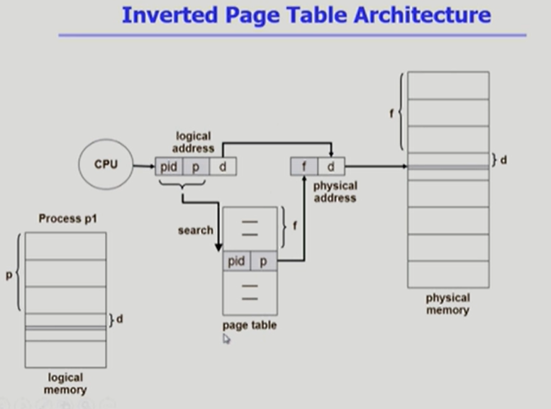
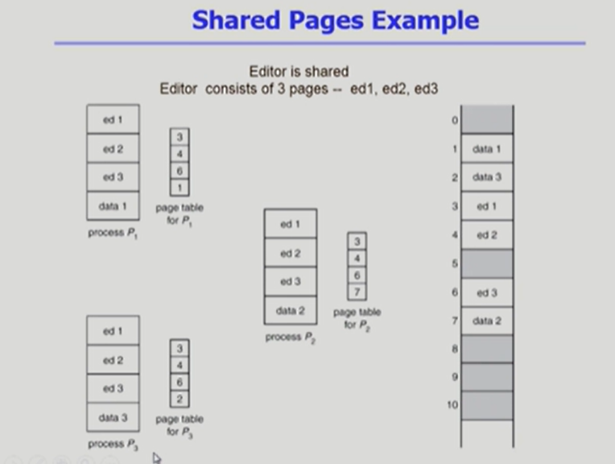

### Paging Example

- 프래그램마다 보통 백만개 이상의 페이지로 나누어진다.
- 프로그램마다 페이지 테이블이 필요하고 페이지테이블의 크기가 굉장히 크기 때문에 페이지테이블은 물리메모리에 저장한다.

### Address Translation Architecture

- 논리 주소의 offset 부분은 변하지 않는다.

### Implementation of Page Table

- Page table은 메인 메모리에 상주한다.
- Page-table base register(PTBR)가 page table을 가리킨다.
- Page-table length register(PTLR)가 테이블 크기를 보관
- 따라서 모든 메모리 접근 연산에는 2번의 memory access가 필요하다.
- page table 접근 1번, 실제 data/instruction 접근 1번 
- 속도 향상을 위해 associative register 혹은 translation look-aside buffer(TLB)라 불리는 고속의 lookup hardware 캐시를 사용한다.

### Paging Hardware with TLB

- page table은 실제적으로는 physical memory에 저장되어 있다.
- TLB는 page table에서 빈번히 참조되는 일부 엔트리를 캐싱한다.
- CPU가 메모리접근을 위한 논리주소를 주면 page table에 가기전에 TLB에 저장되어 있는 지를 확인하여 주소변환한다. 
  - TLB에 매핑되는 page number가 있는 경우 주소변환을 하여 메모리 접근을 한 번만 하면 된다.
  - TLB에 매핑되는 page number가 없는 경우 page table에 접근하는 연산 까지 총 메모리 접근을 2번 해야 한다.

#### Effective Access Time

### Two-Level Page Table

#### 2단계 페이지 테이블의 사용 이유

> page table의 공간을 줄이기 위해서 사용한다.

- 현대 컴퓨터는 주소공간이 매우 큰 프로그램을 지원한다 (ex 32bit - 4G의 주소 공간)
  - page size가 4K인 경우 1M(약 백만개)의 page entry가 필요하다.
  - 따라서 각 page entry가 4B일 경우 프로세스당 4MB의 page table이 필요하다.
  - 그러나 대부분 프로그램은 4G의 주소 공간 중 **지극히 일부분만 사용**하므로 page table 공간이 심하게 낭비된다.
  - **logical address의 크기 만큼 필연적으로 페이지 테이블이 만들어져야 하는 문제를 해소할 수 있다!**
    - 사용되지 않는 주소공간에 대해 바깥 테이블의 엔트리 값을 NULL로 만든다.
- Address-Translation Scheme

- Two-Level Paging Example

logical address 32bit의 프로그램, page size가 4K인 경우.

1. 하나의 페이지 안에서 몇 번째 byte인지 구분하기 위한 offset = 4K = 12bit
2. 페이지의 개수 = 4G(32bit program) / 4k(page number) = 32bit - 12bit = 20bit 
3. 하나의 페이지(4kB)에 4B의 엔트리 1k개가 있다. -> p2(안쪽 page table)는 10bit가 된다.
4. 바깥쪽 page table은 32 - 12 - 10 = 10bit가 된다.

### Multilevel Paging and Performance

- 주소 공간이 더 커지면 다단계 페이지 테이블이 필요하다.
- 각 단계의 페이지 테이블의 메모리에 존재하므로 logical address의 physical address 변환에 더 많은 메모리 접근이 필요하다.
- TLB를 통해 메모리 접근 시간을 줄일 수 있음.
- 4단계 페이지 테이블을 사용하는 경우
  - 메모리 접근 시간이 100ns, TLB 접근 시간이 20ns이고 TLB hit ratio가 98%인 경우
    - effective memory access time = 0.98 * 120  + 0.02 * 520 = 128ns
    - memory access time without TLB = 500ns

### Valid (v)/ Invalid (i) Bit in a Page Table

- 프로그램의 logical address 크기 만큼 페이지테이블이 존재해야 하므로 사용되지 않는 영역에 대한 invalid bit 표시가 필요하다.
- valid : 실제로 프레임에 유효한 내용이 올라와 있음을 의미
  - 해당 페이지가 물리메모리에 올라와 있다.

- invalid : 해당 주소의 frame에 유효한 내용이 없음을 의미
  1. 물리메모리에 해당 페이지가 올라와 있지 않고 backing store에 내려가 있는 경우
  2. 프로세스가 그 주소를 사용하지 않는 경우.

### Memory Protection

- Page table마다 아래의 bit를 둔다.
  - Protection bit
    - page에 대한 접근 권한

  - valid-invalid bit

### Inverted Page Table

- page table이 매우 큰 이유
  - 프로세스마다 logical address에 대응하는 모든 page에 대한 entry가 존재해야 하기 떄문이다.

- Inverted Page Table Architecture

- 시스템 안에 페이지 테이블이 단 하나 존재한다.
- 물리메모리에 페이지 프레임 개수만큼 페이지 테이블 엔트리가 존재한다.
- 각 페이지 테이블 엔트리는 물리메모리의 page frame이 담고 있는 내용(프로세스id, process의 논리주소)을 표시한다.
- 사실상 물리메모리를 보고 논리주소를 알아내는 방식으로, 논리주소 -> 물리주소 변환을 위해서는 물리주소를 전부 검색하면서 논리주소를 알아내야 한다. 
  - 시간적 오버헤드가 있지만, 메모리를 줄일 수 있긴 하다.
  - associative register 사용해서 인트리들을 병렬검색할 수 있게 해서 시간 오버헤드를 줄일 수 있다. (비쌈)

### Shared Page

- Shared code
  - Re-entrant Code라고 한다.
  - read-only로 세팅해야 한다.
  - 동일한 논리 주소 공간에 위치해야 한다.

- Shared Pages Example

