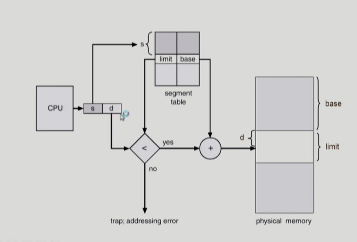
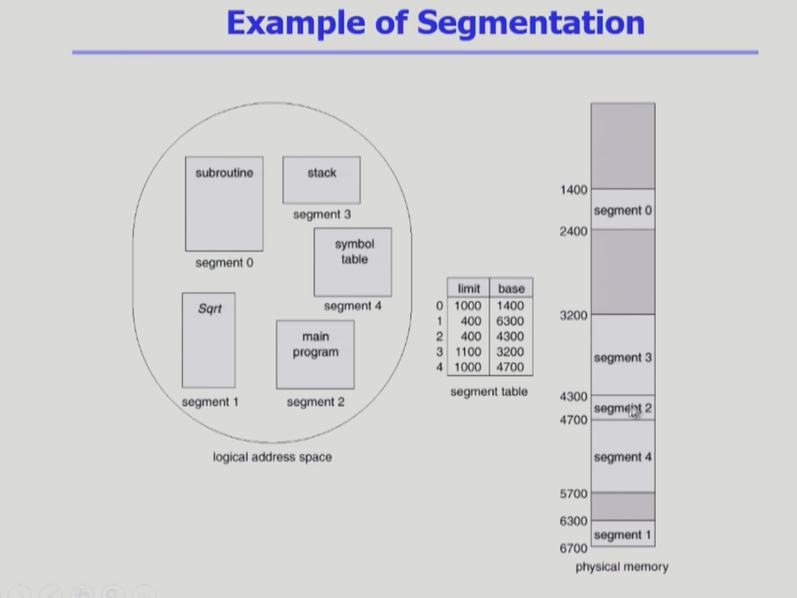
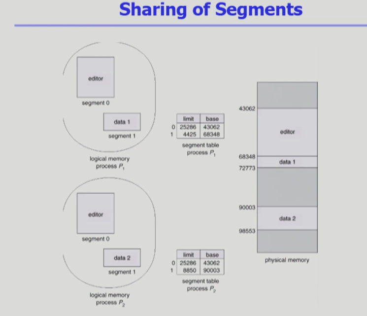
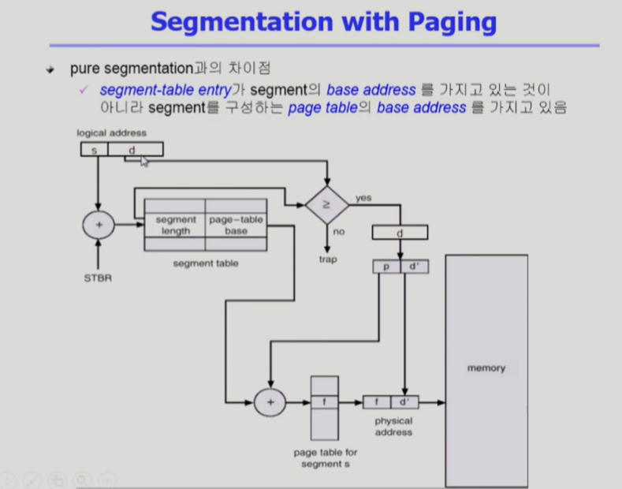

### Segmentation Architecture

- 논리 주소는 다음 두 가지로 구성된다.
  - segment-number
  - offset
- **Segment table** 구성
  - base - 세그먼트 테이블의 시작을 나타내는 용도
  - limit - 세그먼트의 길이
    - 모두 같은 크기의 page와 달리 세그먼트 별로 길이가 다르므로 limit에 대한 정보를 table에서 가지고 있어야 한다.

#### 세그먼트와 페이지의 비교

- Protection
  - 각 세그먼트 별로 protection bit가 있다.
    - valid bit 
    - R/W/Execution 권한 bit
- Sharing
  - shared segment
  - same segment number
- **segment는 의미 단위이기 때문에 공유와 보안에 있어 page보다 훨신 효과적이다!**
- Allocation
  - first bit/ best fit
  - external fragmentation 발생
  - segment의 길이가 동일하지 않기 때문에 가변분할 방식에서와 동일한 문제점이 발생한다.

### Segmentation Hardware

- paging인 경우에는 논리 주소의 최대 영역만큼의 page entry가 만들어진다.
- segmentation의 경우에는 프로그램이 사용하는 segment의 개수만큼 entry가 만들어진다.
- segment가 물리메모리의 어디 부분에 올라와 있는가? -> segment base, limit를 통해 주소변환을 할 수 있다.

- segment는 의미 단위이기 때문에 segment의 길이가 제각기 달라서 segment table entry에 limit을 통해 길이를 알 수 있다.
  - 이로 인해 가변분할방식에서와 같은 문제점(hole에 의한 문제)들이 발생한다.

### Example of Segmetation

- segmentation은 hole들이 존재하지만, table을 위한 메모리 낭비는 paging 기법이 대단히 심하다.
  - page의 개수가 의미 단위인 segment보다 훨씬 많기 때문에

### Sharing of Segments

- page sharing에서와 같이 같은 논리 주소, 즉 같은 segment 번호여아 한다. 
  - 컴파일된 실행코드가 같은 코드여야 하기 때문이다.
- shared segment인 editor는 segment 0 으로 같은 segment 번호로 통일하고 있는 모습.

### Segmentation with Paging

- pure segmentation과의 차이점
  - segment-table entry가 segment의 base address를 가지고 있는 것이 아니라 segment를 구성하는 page table의 base address를 가지고 있다.