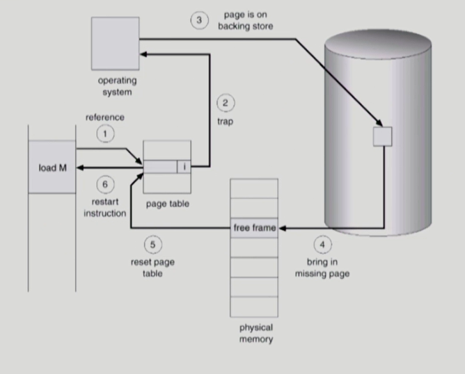
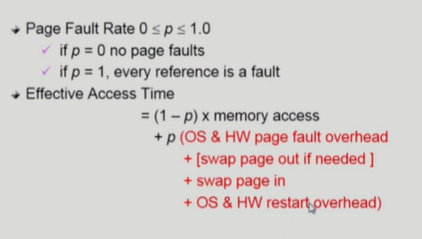
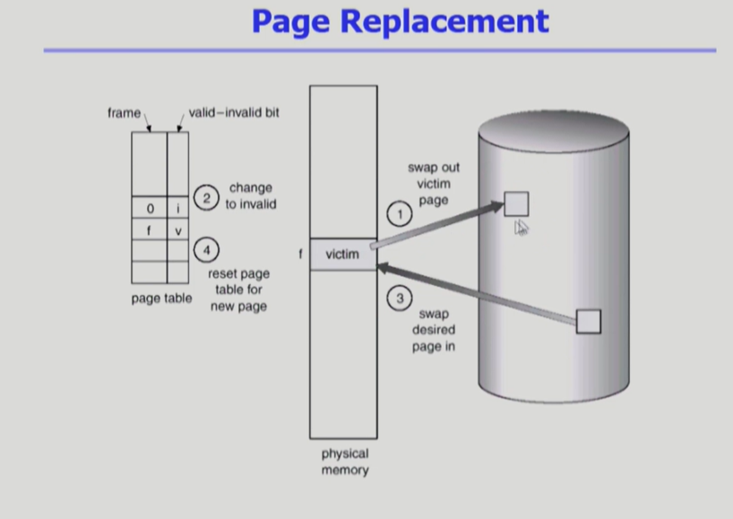
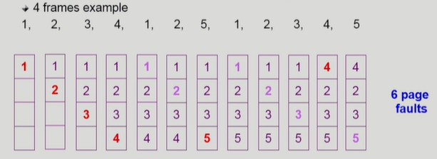
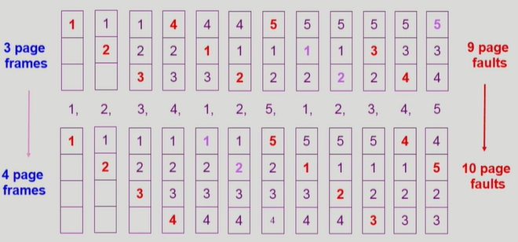
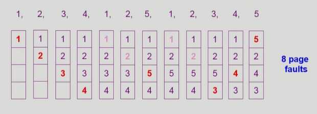
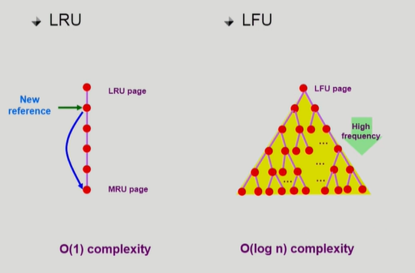
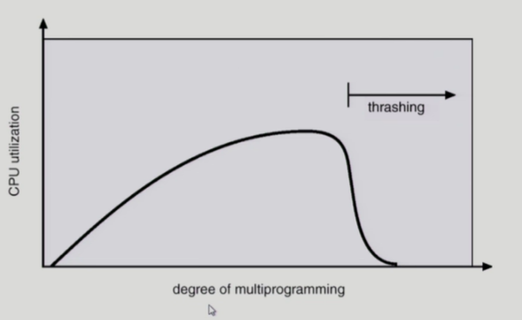
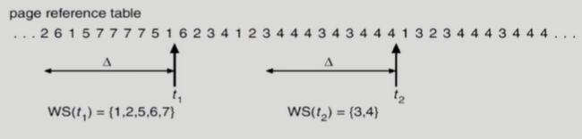
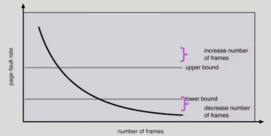

## [가상 메모리 #1](https://core.ewha.ac.kr/publicview/C0101020140509142939477563?vmode=f)

### Demand Paging

- 실제로 필요할 때(요청이 있을 때) page를 메모리에 올리는 것
  - I/O 양의 감소
  - Memory 사용량 감소
  - 빠른 응답 시간
  - 더 많은 사용자 수용
- Valid/Invalid bit를 사용한다.
  - valid : 물리메모리에 실제 페이지가 올라와 있다.
  - invalid : 물리메모리에 실제 페이지가 올라와 있지 않다. or 사용되지 않는 주소공간이다.
  - 초기에는 page entry 가 모두 invalid로 초기화 되어 있다.
  - page fault
    - address translation 시에 invalid bit이 set되어 있는 경우

### Page Fault

- invalid page에 접근하면 MMU가 trap을 발생시킨다.(page fault trap)
- kernel mode로 들어가서 page fault handler가 동작한다.

- page fault handler의 동작 순서
  1. 잘못된 요청인지 확인. invalid reference(bad address, protection violation) => abort process
  2. 물리메모리의 빈 페이지 프레임을 가져온다. 
     - 없는 경우 사용중인 페이지 프레임을 replace한다.
  3. 해당 페이지를 disk에서 memory로 읽어온다.
     1. disk I/O가 끝나기까지 이 프로세스는 CPU를 preempt 당함 (block)
     2. disk read가 끝나면 page tables entry 기록. valid/invalid bit = "valid"
     3. 준비 큐에 process를 삽입 -> dispatch later
  4. 이 프로세스가 CPU를 선점하고 다시 running

#### Performance of Demand Paging

#### Free frame이 없는 경우(2)

- page replacement
  - 어떤 프레임을 빼앗아올지 결정해야 한다.
  - 곧바로 사용되지 않을 page를 쫓아내는 것이 좋다.
  - 동일한 페이지가 여러 번 메모리에서 쫓겨났다가 다시 들어올 수 있음
- Replacement Algorithm
  - page-fault rate를 최소화하는 것이 목표
  - 주어진 page reference string에 대해 page fault를 얼마나 내는 지 조사하는 방식

### Optimal Algorithm

- MIN(OPT) : 가장 먼 미래에 참조되는 page를 replace한다.
  - 미래를 알 수는 없기 때문에 Offline으로 page reference string을 미리 알고 있다는 가정하에 운영한다.

- 실제로 사용되는 것은 아니고, replacement 알고리즘에 대해 upper bound로 사용된다.

### FIFO(First In First Out) Algorithm

- 가장 먼저 들어온 page를 먼저 replace
- FIFO Anomaly
  - 프레임이 많아질수록 page fault가 줄어들어야 하는데 늘어나는 현상이 발생 

### LRU(Least Recently Used) Algorithm

- 가장 오래전에 사용된(**참조된**) page를 replace

### LFU(Least Frequently Used) Algorithm

- 참조횟수가 가장 적은 페이지를 replace
- 최저 참조 횟수 page가 여러 개인 경우
  - LFU 알고리즘 자체에서는 여러 page 중 임의로 선정한다.
  - 성능 향상을 위해 가장 오래 전에 참조된 page를 지우게 구현할 수도 있다.

- 장단점
  - LRU처럼 참조 시점만 보는 것이 아니라 장기적인 시간 규모를 고려하기 때문에 page의 인기도를 정확히 반영 가능하다
  - 참조 시점의 최근성을 반영하지 못하는 단점
  - LRU보다 구현이 복잡하다는 단점
  - LR

### :star:LRU와 LFU 알고리즘의 예제 및 구현

- LRU 
  - 시간 순서대로 기록하고 가장 오래전에 참조된 페이지를 교체하면 되기 때문에 연결리스트로 구현(큐로도 가능해보이긴 하는데?)
  - O(1)
- LFU
  - min heap으로 구현
  - O(log n)

## [가상 메모리 #2](https://core.ewha.ac.kr/publicview/C0101020140513133424380501?vmode=f)

### 다양한 캐싱 환경

- 캐싱 기법
  - 한정된 빠른 공간(캐시)에 요청된 데이터를 저장해 두었다가 후속 요청 시 캐시로부터 직접 서비스하는 방식
  - paging system 외에도 캐시 메모리, 버퍼 캐싱, 웹 캐싱 등 다양한 분야에서 사용한다.
- 캐싱 운영의 시간 제약
  - 교체 알고리즘에서 삭제할 항목을 결정하는 일에 지나치게 많은 시간이 걸리는 경우 실제 시스템에서 사용할 수 없음.
  - 버퍼 캐싱이나 웹 캐싱의 경우
    - O(1)에서 O(log n) 정도까지 허용
  - Paging system인 경우
    - page fault인 경우에만 OS가 관리한다.
    - **따라서 페이지가 이미 메모리에 존재하는 경우 참조시각 등의 정보를 OS가 알 수 없다.**
    - O(1)인 LRU의 list 조작조차 불가능하다.
    - **반쪽 정보만 주어지기 때문에 LRU, LFU 알고리즘은 사용할 수가 없다.**

### Clock Algorithm

- LRU의 근사 알고리즘
- (NRU)Not Recently Used
- Reference bit를 사용해서 교체 대상 페이지 선정
  - Reference bit이 0인 페이지를 찾을 때까지 포인터를 하나씩 앞으로 이동한다.
  - 포인터를 이동하는 중에 reference bit 1은 모두 0으로 바꿈
  - Reference bit이 0인 것을 찾으면 그 페이지를 교체한다.
  - 한 바퀴를 돌아도 Reference bit이 0이면 그때는 replace 당함?
  - 자주 사용되는 페이지라면 두번째 포인터가 올 때 1
- Clock algorithm의 개선
  - modified bit(dirty bit)을 함께 사용하기
  - reference bit = 1 : 최근에 참조된 페이지
  - modified bit = 1 : 최근에 변경된 페이지(I/O를 동반하는 페이지)

### Page Frame의 Allocation

- Allocation problem : 각 프로세스에 얼만큼의 페이지 프레임을 할당할 것인가에 대한 문제
- Allocation의 필요성
  - 메모리 참조 명령어 수행시 명령어, 데이터 등 여러 페이지 동시 참조
    - 명령어 수행을 위해 최소한 할당되어야 하는 frame의 수가 있다.

  - Loop를 구성하는 page들은 한꺼번에 allocate 되는 것이 유리하다.
    - 최소한의 allocation이 없으면 매 loop마다 page fault

- Allocation Scheme
  - Equal allocation : 모든 프로세스에 똑같은 페이지 개수 할당
  - Proportional allocation : 프로세스 크기에 비례하여 할당
  - Priority allocation : 프로세스의 priority에 따라 다르게 할당

### Global vs. Local Replacement

- Global replacement
  - Replace 시 다른 프로세스에 할당된 프레임을 빼앗아 올 수 있다.
  - 프로세스별 할당량을 조절하는 또 다른 방식이다.
  - LRU, LFU 등 알고리즘을 다른 프로세스들과 함께 운영
  - Working set, PFF 알고리즘 사용

- Local replacement
  - 자신에게 할당된 frame 내에서만 replacement
  - LRU, LFU 등의 알고리즘을 프로세스 별로 운영

### Thrashing

- 프로세스의 원할한 수행에 필요한 최소한의 page frame 수를 할당 받지 못한 경우에 발생하는 현상이다.
- Page fault rate가 매우 높아짐.
- CPU utilization이 매우 낮아짐 -> OS는 Multiprogramming degree를 높여야 한다고 판단하여 또 다른 프로세스를 시스템이 추가함 ->  프로세스 별 page frame 수가 더욱 감소 -> 프로세스는 page의 swapping으로 매우 바쁜 반명 CPU는 한가해짐

### Working-Set Model

- Locality of reference
  - 프로세스는 특정 시간 동안 일정 장소만을 집중적으로 참조한다는 특성
  - 집중적으로 참조되는 page들의 집합을 locality set이라고 한다.

- Working-set Model
  - Locality에 기반하여 프로세스가 일정 시간 동안 원할하게 수행되기 위해 한꺼번에 메모리에 올라와 있어야 하는 page들의 집합을 Working set이라고 정의함.
  - Working Set 모델에서는 프로세스의 working set 전체가 메모리에 올라와 있어야 수행되고 그렇지 않을 경우 모든 frame을 반납한 후 swap out
  - Thrasing을 방지함
  - Mulitiprogramming degree를 결정함.

### Working-Set Algorithm

- working set의 결정
  - working set window를 통해 알아낼 수 있다.
  - [t, t+window size]내에서 참조된 서로 다른 페이지들의 집합을 working set으로 간주한다.
  - working set에 속한 page는 메모리에 유지, 속하지 않은 것은 버리는 것과 같다.

- working-set 알고리즘
  - 프로세스들의 working set size의 합이 page frame의 수보다 큰 경우
    - 일부 프로세스를 swap out시켜 남은 프로세스들의 working set을 우선적으로 충족시킨다 -> MPD 감소
    - working set을 다 할당하고도 페이지 프레임이 남는 경우
      - swap out되었던 프로세스들에게 working set을 할당 -> MPD 증가

- window size
  - working set을 제대로 탐지하기 위해서는 window size를 잘 결정해야 함.
  - window size가 너무 작으면 locality set을 모두 수용하지 못할 가능성이 커지고,
  - window size가 너무 크면 locality set이 불필요하게 커져서 Thrasing을 방지하지 못할 수 있다.

### PFF(Page-Fault Frequency) Scheme

- page fault rate에 따라 page frame 수를 조절하는 방법.
  - page fault rate이 상한값을 넘으면 frame을 더 할당
  - page fault reate이 하한값을 넘으면 frame을 감소

### Page Size의 결정

- page size를 감소시키면
  - 페이지 수 증가
  - 페이지 테이블 크기 증가
  - internal fragmentation 감소
  - Disk transfer 효율성 감소
  - 필요한 정보만 메모리에 올라와 메모리 이용이 효율적
    - Locality 활용 측면에서는 좋지 않다.
  - 최근 저장공간이 커지면서 Disk transfer의 효율성이 페이지 크기가 클수록 좋아지기 때문에 page 크기가 커지는 추세