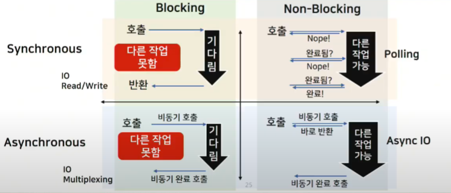

# Operating System

> 시스템 하드웨어를 관리하고, 응용 소프트웨어를 실행하기 위해 **하드웨어 추상화 플랫폼**과 **공통 시스템 서비스**를 제공하는 시스템 소프트웨어

### 컴퓨터가 소수점 계산을 잘 못하는 이유와 해결방안

컴퓨터는 2진법을 사용하기 때문에 10진법에서 유한소수가 2진법에서 무한소수일 수 있기 때문이다.

해결방법으로는 10진수 연산을 구현해서 소수점 계산을 하는 방법이 있다.

### 컴파일러와 인터프리터의 차이

- 컴파일러
  - 프로그램 전체를 한 번에 기계어로 번역하는 방식
  - 고급 언어로 작성한 원시 코드를 기계어인 목적 코드로 번역.
  - C, C++
    - 바로 기계어로 변환하기 때문에 하드웨어 제어 시스템에서 매우 효율적이다.

- 인터프리터
  - 프로그램을 한 행씩 읽어 기계어 번역과 실행을 동시에 하는 방식
  - 각 행마다 실행하는 도중 에러가 보고되면 이후 코드를 보지 않는다.
  - 파이썬

**자바는 컴파일러와 인터프리터를 모두 사용한다**

- 인터프리팅은 플랫폼에 종속되지 않고, 자바 바이트 코드(.class)는 컴퓨터와 프로그램 사이에 별도의 버퍼 역할을 하기 때문에 보안적인 측면에서 유리하다.
- 컴파일러
  - javac를 통해 *.java -> *.class 로 변환
- 인터프리터
  - .class -> JVM용 기계어로 변환

### 여러 프로그램이 동시에 실행되는 원리(싱글 코어에서)

- CPU는 한 번에 하나의 명령어만 수행 가능하다. 근데 어떻게 동시에 실행될까?
  - 시분할 방식으로 여러개의 프로그램을 분할해서 수행하기 때문에 여러 프로그램이 동시에 실행되는 것 처럼 보인다.
  - 2.4MHz - 240만개의 명령어가 1초에 수행된다.

## 프로세스

### 프로세스와 스레드의 개념과 차이점

주소 공간을 기준으로 설명하기.

프로세스는 실행 중인 프로그램을 의미하고, 스레드는 프로세스 내에서 실행되는 작업 단위입니다.

프로세스는 독립된 주소공간을 가지고 있지만, 스레드는 프로세서의 일부 주소공간(Code, Data, Heap)을 공유하고 있습니다.

이로인해 프로세스는 다른 프로세스의 리소스에 접근하려면 IPC를 사용해야 하지만, 스레드는 별도의 기술 없이 접근할 수 있습니다.

**스택을 스레드마다 독립적으로 할당하는 이유**

스택은 함수 인자, 되돌아갈 주소값, 함수 내 변수를 저장하기 위해 사용되는 메모리 공간이다. 따라서 스택이 독립적이라는 것은 독립적인 함수호출이 가능하다는 것이고 이는 독립적인 실행 흐름이 추가하기 위한 최소조건이기 때문에 스레드마다 스택을 할당한다.

**PC 레지스터를 스레드마다 독립적으로 할당하는 이유 **

PC값은 스레드가 명령어의 어디까지 수행했는 지를 나타낸다. 명령어 수행 진도를 알아야 하기 때문에  독립적으로 할당한다.

### 멀티스레드와 멀티프로세스의 장단점

**멀티스레드의 장점**

1. 적은 메모리 공간 차지, 통신 비용 감소.

2. context switch가 빠르다

스레드는 프로세스 내의 전역 변수나, 동작 할당 메모리를 공유하기 때문에 데이터를 주고 받는 방식이 간단해지고 통신 방식이 훨씬 간단합니다. 또한, 멀티프로세서의 경우 Contxt switch할때 단순히 레지스터 교체 뿐만아니라 캐시메모리까지 초기화 되지만, 스레드 간 context switch는 캐시 메모리를 비울 필요가 없어서 효율적입니다.

**멀티스레드의 단점**

동기화 문제 - 스레드 간 자원 공유는 전역 변수를 이용하므로 충돌이 발생할 수 있어서 thread-safe하게 구현해야 할 필요성이 있습니다.

### 멀티스레드와 멀티프로세스의 예시

공유한 데이터를 읽고 빠른 처리가 우선적으로 필요한 경우 데이터 충돌에 대한 우려가 없기 때문에 멀티스레드를 쓰는 것이 좋습니다.

반면 데이터를 읽고 쓰는 작업이 빈번하다면, 뮤텍스와 같은 동기화를 많이 사용해야하고, 데드락 같은 상황이 발생할 위험을 줄이기 위해서 멀티 프로세스를 고려하는 것이 좋습니다.

### 쓰레싱이란

동시에 실행하는 프로세스의 개수가 많아지다가 결국 페이지 폴트가 증가해 스와핑을 위한 I/O작업이 많아지면 CPU의 사용량이 떨어집니다. 이 때 CPU 사용량이 급감하기 시작하는 것을 쓰레싱이라고 합니다.

### 유저 수준 스레드와 커널 수준 스레드의 차이

일반적으로 유저 수준 스레드는 사용자가 생성하는 스레드이고, 커널 수준 스레드는 실제 시스템에서 실행되는 스레드를 말합니다.

### 멀티스레딩을 지원하는 방법

다대일 ,일대일, 다대다 방법이 있습니다. 다대일 모델은 여러 개의 유저 수준 스레드를 하나의 커널 수준 스레드에 대응하는 방식이고, 일대일 모델을 하나의 유저 수준 스레드와 하나의 커널 수준 스레드를 대응하는 방식입니다. 다대다 방법은 여러 유저 수준 스레드를 여러 커널 수준 스레드와 대응하는 방식입니다.

하나의 유저 수준 스레드에서 blocking연산을 하는 경우 다른 모든 유저 수준 스레드가 멈추게 되고, 커널 수준 스레드는 오버헤드가 크므로 현실적으로 다대다 모델이 주로 사용됩니다.

모든 유저 수준 스레드가 멈추는 이유 - 커널에서는 스레드가 아니라 프로세스 하나라고 생각하기 때문에.

### Thread safe한 코드를 만들 수 있는 방법

**Thread safe의 정의**

멀티 스레드 프로그래밍에서 하나의 변수나 객체에 여러 스레드가 동시에 접근해도 프로그램이 정상적으로 실행되는 상태를 말한다.

**Thread-safe를 지키기 위한 방법**

http://web.mit.edu/6.005/www/fa15/classes/20-thread-safety/

1. Confinement
   - 데이터를 단일 스레드에서만 접근할 수 있도록 하여 데이터의 공유 자체를 피한다.
   - 스택에 한정되도록 프로그래밍하는 방식.
2. Immutable
   - 공유되는 데이터라도 변경 불가능한 데이터 유형을 사용한다.
   - C++의 `const`, Java의 `private`
3. Thread-safe Data Types
   - Java의 `StringBuffer` (vs `StringBuilder`)
   - `java.concurrent` 패키지 하위의 자료구조들 사용하기
4. Synchronization
   - lock 사용하기

**Java를 이용해 Thread safe한 프로그램 만들기**

1. Lock 사용
   -  `synchronized`
2. `java.concurrent` 패키지 하위의 자료구조들 사용하기
3. 스택에 한정되도록 프로그래밍하기
   - 스택을 벗어나는 순간 변수를 참조할 수 없다는 단점 -> `ThreadLocal`을 이용해 스레드 영역에 변수를 설정할 수 있다. 특정 스레드가 실행하는 모든 코드에서 그 스레드에 설정된 변수 값을 사용할 수 있게 된다(??)
4. 불변객체 사용하기
   - final keyword 
   - `String`

### 멀티 스레드 프로그래밍에서 스레드 동기화 방법

유저 모드 동기화 방식과 커널 모드 동기화 방식 두 가지가 있다.

유저 모드 동기화는 커널 코드가 실행되지 않는 방법이다. 동기화 과정에서 커널모드로 전환하지 않기 때문에 성능상의 이점이 있지만, 그만큼 사용자가 직접 고려해야할 부분이 많아지고 기능상의 제한도 있다. 대표적인 방식으로는 Cirtical Section 기법, 인터락 함수가 있다.

커널모드 동기화는 커널에서 제공하는 동기화 기능을 활용하는 방식으로, 동기화 관련 함수 호출마다 커널모드로 전환해야한다.  대표적인 방식으로는 뮤텍스, 세마포어가 있다.

### PCB가 사용하는 자료구조

연결리스트. 프로세스 생성 시 리스트에 추가되고, 프로세스 완료시 제거해야 되기 때문에 삽입 삭제가 빈번하다. 따라서 연결리스트가 유리하다.

### OS 스케줄링에 대해서 설명.

어떤 프로세스가 시스템 자원(CPU, 메모리 등)을 차지할 지 결정하는 작업. 시스템 자원을 효율적으로 사용하기 위해 필요합니다.

#### 필요한 이유

프로세스마다 CPU bound 프로세스, I/O 바운드 프로세스 등 CPU를 사용하는 패턴이 상이하기 때문에 시스템 자원을 골고루 효율적으로 사용하기 위해서 필요하다. 

### CPU 스케줄링이 필요한 이유

CPU나 자원을 효율적으로 사용하기 위해 필요합니다. 프로세스에는 I/O 작업이 빈번한 I/O bound 프로세스도 있고, CPU bound 프로세스도 있고  각기 다른 프로세스들을 적절히 스케줄링함으로써 시스템자원들을 골고루 효율적으로 사용할 수 있기 때문에 CPU 스케줄링이 필요합니다. 

- 스케줄링의 척도
  - 처리율 증가, CPU이용률 증가, 반환시간, 대기시간, 응답시간 최소화

#### 선점 스케줄링과 비선점 스케줄링의 차이와 종류

- 선점형
  - 하나의 프로세스가 다른 프로세스 대신에 CPU를 차지할 수 있다.
  - 선점이 가능하도록 인터럽트용 타이머 클록이 필요하다.
  - 주로 빠른 응답시간을 요구하는 **대화식 시분할 시스템**에 사용된다.
  - SRTF(Shortest Remaining Time First) , Priority, 라운드 로빈
- 비선점형
  - 실행중인 프로세스가 끝나지 않으면 다른 프로세스는 CPU를 차지할 수 없다.
  - FCFS(First Come First Start), SJF(Shortest Job First), Priority(Ready queue의 Head에 넣는 방식)

### 스케줄러의 종류

- 장기스케줄러 
  - 시작 프로세스 중(디스크에 있는 프로세스) 중 ready 큐에 보낼 프로세스를 결정
  - 실행중인 프로세스의 수 제어
- 중기 스케줄러  
  - ready 큐에 있는 프로세스 중 디스크로 쫓아낼 프로세스를 결정
  - 실행 중인 프로세스의 수 제어

- 단기 스케줄러
  - ready 큐에 있는 프로세스 중 실행시킬 프로세스를 결정

### 비동기와 동기의 차이점?

요청에 따른 결과의 순서 보장이 되느냐 안되느냐의 차이

동기는 작업 완료를 user space에서 판단.

비동기는 작업 완료를 kernel space에서 판단.

### blocking과 Non-blocking의 차이점

blocking은 호출된 함수가 종료되기 전까지 호출한 함수에게 제어권을 돌려주지 않는 것.

non-blocking은 호출된 함수가 바로 호출한 함수에게 제어권을 넘겨주는 것.

*동기-비동기와 blocking - nonblocking은 독립적인 개념이다. 동기-비동기는 순서

참고 : https://incredible-larva.tistory.com/entry/IO-Multiplexing-%ED%86%BA%EC%95%84%EB%B3%B4%EA%B8%B0-1%EB%B6%80

### 프로세스 동기화의 문제점과 해결방법 구체적으로

critical section problem

Mutex Lock

- critical section에 진입하는 프로세는 Lock을 획득하고, 빠져나올 때 Lock을 방출하여 동시 접근을 막는 방법.

Semaphores

- 일종의 추상 자료형으로, 공유 자원의 획득 가능 횟수와 세마포어 획득 연산과 반납연산을 통해 데이터 접근을 컨트롤하는 방식.

- busy-wait
- block-wakeup

### 교착상태와 4가지 조건 및 해결방법

교착상태랑 2개 이상의 스레드 혹은 프로세스가 상대방의 작업이 끝나기를 무한히 기다리게 되는 상태를 말합니다.

4가지 필요조건으로는 상호 배제, 점유와 대기, 비선점, 환형대기가 있습니다.

교착상태를 해결하기 위해서는 이 조건 중 하나라도 제거하면 해결할 수 있으며, 예방, 회피, 탐지, 복구의 방식이 있습니다.

### 메모리 관리 기법의 배경과 종류

- 다중 프로그래밍 시스템이 많아지면서 한정된 메모리에 다수의 프로세스를 더욱 효율적으로 수용하기 위해서 가상 메모리가 사용되었고, 페이징, 세그멘테이션 등의 기법이 필요하게 됨.
- 크게 연속할당방식과 non-contigous 할당방식이 있는데, 연속할당방식은 말그대로 프로세스를 메모리의 연속적인 공간에 할당하는 방법이다. 또한, 고정 분할과 동적 분할 방식이 있는데, 고정 분할방식은 내부 단편화 문제가 있고, 동적 분할방식은 외부단편화 문제가 발생한다. 불연속 할당방식은 하나의 프로세스가 메모리의 여러 영역에 나뉘어 올라갈 수 있는 방법이다.

### Paging

- 가상메모리를 page 단위로 나누어 noncontigous하게 저장하는 방법으로, 외부 조각화문제를 해결하는 데 사용됩니다.

- 내부 단편화 문제

### Segmentation

- 프로세스의 가상메모리를 서로 다른 크기의 논리적 단위인 segment 단위로 나누어 메모리에 noncontiguous하게 저장하는 방법. 

- 외부단편화 문제

### 가상 메모리

각 프로그램에 실제 메모리 주소가 아니라 가상의 메모리 주소를 주는 방식을 말한다. 한정된 물리 메모리에 다수의 프로세스를 효율적으로 수용하기 위해서 사용된다.

### 주소바인딩의 종류와 설명(분류하는 기준)

### 요구 페이징

실제로 필요할 때 페이지를 backing store(디스크)에서 메모리에 올리는 것을 말합니다.

### 페이지 교체 알고리즘

가장 이상적인 페이지 교체 방법은 앞으로 가장 먼 미래에 참조되는 페이지를 교체하는 것이다.

실제로 미래를 알 수는 없기 때문에 이 옵티멀 알고리즘에 가장 가까운 결과를 낼 수 있는 알고리즘을 선택해야 한다. LRU, LFU, MFU 등이 있다.

### 캐시의 지역성

캐시란? 자주 사용하는 데이터나 값을 미리 복사해 놓는 임시장소.
