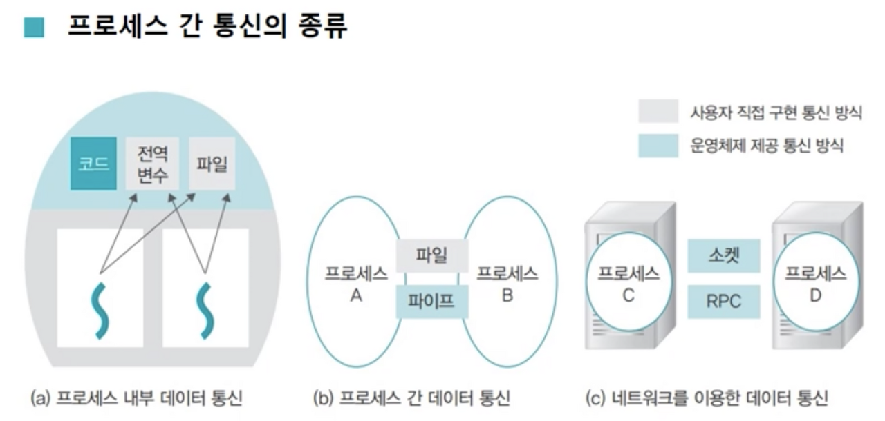

# 프로세스 간 통신

a. 프로세스 내부 데이터 통신

- 한 프로세스 안에 두 개 이상의 스레드가 존재하는 경우 
- 전역 변수를 이용한 통신
  - shared memory를 사용하여 데이터를 주고 받는 것
  - RAM의 특성 상 길이가 고정되어 있다!

b. 프로세스 간 데이터 통신

- 같은 컴퓨터에 있는 프로세스끼리 통신하는 경우, 공용 파일이나 파이프를 사용하여 통신
- 파일을 이용한 통신
  - 운영체제가 동기화를 지원하지는 않는다.
- 파이프를 이용한 통신
  - 한쪽에서 읽고 한쪽에서 쓰는 단방향 통신 방식 - 동기화 신경을 덜 써도 되기 때문에 직렬화된 데이터를 통신하는 데에 유리하다.
  - 양방향 통신을 위해서는 2개의 파이프가 필요하다.
  - 운영체제가 자동으로 동기화를 지원해준다.(`busy waiting` x)
  - 이름 없는 파이프
    - 일반적인 파이프. 부모와 자식 프로세스와 같이 서로 관련 있는 프로세스 간 통신에 사용된다.
  - 이름 있는 파이프
    - FIFIO라 불리는 특수 파일을 이용하며, 서로 관련 없는 프로세스 간 통신에 사용된다.

c. 네트워크를 이용한 데이터 통신

- Remote Procedure Communication(RPC)
  - 일반적으로 소켓을 이용하여 구현한다.
  - 자바 같은 경우 다른 컴퓨터에 있는 객체의 메서드를 호출하는 것이 원격 프로시저 호출이다.
  - 소켓이 동기화 지원해줘서 `busy wating`하지 않아도 된다.

d. 윈도우 한정

- Registry를 이용한 통신

- data segment
  - data_seg pragma
  - https://seonbicode.tistory.com/12?category=605912
